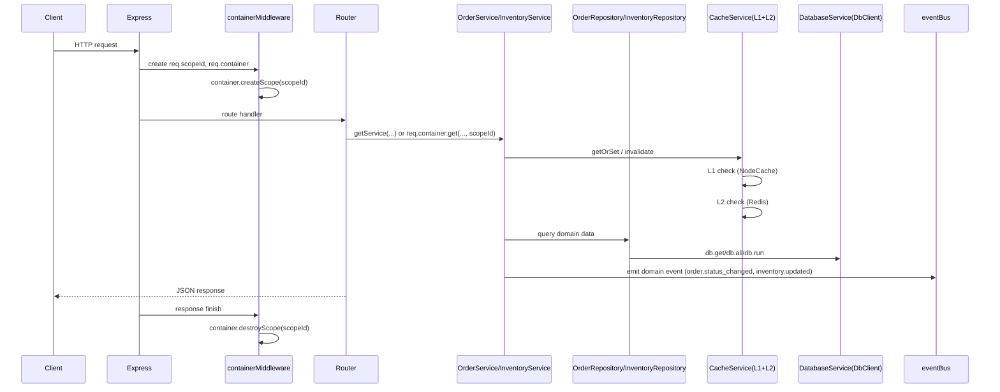

# Servio – Change Hierarchy & Wiring Diagrams (Updated)

This document captures the **current (post-refactor)** hierarchy and wiring for:
- **Request-scoped DI** (`ServiceContainer` + per-request scope middleware)
- **Repository + Service layer split** (Orders + Inventory refactors)
- **2-layer caching** (L1 in-memory + L2 Redis) with key builder + invalidation patterns
- **HTTP connection pooling** (`HttpClientService`)
- **Server middleware ordering** (Sentry/APM, security, rate limiting, routes)

---

## Updated Hierarchy (Key Files)

### Backend composition

```text
backend/src/
  server.ts
  container/
    ServiceContainer.ts
  bootstrap/
    services.ts
  middleware/
    container.ts
    auth.ts
    errorHandler.ts
    performance.ts
    security.ts
    rateLimit.ts
    validation.ts
  services/
    DatabaseService.ts
    CacheService.ts
    CacheKeyBuilder.ts
    HttpClientService.ts
    OrderService.ts
    InventoryService.ts
    MetricsService.ts
    MonitoringService.ts
    AssistantService.ts
    VapiService.ts
    VoiceOrderingService.ts
    SmsService.ts
    StorageService.ts
  repositories/
    OrderRepository.ts
    InventoryRepository.ts
    interfaces/
      IOrderRepository.ts
      IInventoryRepository.ts
  routes/
    auth.ts
    orders.ts
    inventory.ts
    menu.ts
    health.ts
    ... (other routes)
  errors/
    ServiceErrors.ts
  test/
    ServiceTestContainer.ts
    mocks/
      mockDb.ts
      mockEventBus.ts
      mockDatabaseService.ts
```

---

## Diagram 1 – Request Lifecycle + Scoped DI



Notes:
- `backend/src/middleware/container.ts` attaches `req.scopeId` + `req.container`.
- `backend/src/container/ServiceContainer.ts` supports **singleton/transient/scoped** lifetimes.

---

## Diagram 2 – Service Registration (DI Graph)

```mermaid
graph TD
  subgraph container[ServiceContainer]
    registerServices[registerServices()]
  end

  subgraph infra[Infrastructure]
    db[db: DbClient]
    databaseService[databaseService: DatabaseService]
    cacheService[cacheService: CacheService]
    httpClient[httpClientService: HttpClientService]
    bus[eventBus]
  end

  subgraph repos[Repositories]
    orderRepo[OrderRepository]
    inventoryRepo[InventoryRepository]
  end

  subgraph services[Domain Services]
    orderService[OrderService]
    inventoryService[InventoryService]
  end

  registerServices --> bus
  registerServices --> db
  registerServices --> databaseService
  registerServices --> cacheService
  registerServices --> httpClient

  db --> orderRepo
  db --> inventoryRepo

  orderRepo --> orderService
  inventoryRepo --> inventoryService

  bus --> orderService
  databaseService --> orderService
  cacheService --> orderService

  bus --> inventoryService
  databaseService --> inventoryService
  cacheService --> inventoryService
```

---

## Diagram 3 – Orders: Read/Write Wiring (with Cache + Invalidation)

```mermaid
flowchart TB
  subgraph endpoints[API Endpoints]
    listOrders["GET /api/orders"]
    getOrder["GET /api/orders/:id"]
    updateStatus["POST /api/orders/:id/status"]
    stats["GET /api/orders/stats/summary"]
    waiting["GET /api/orders/waiting-times"]
  end

  subgraph service[OrderService]
    osList[listOrders(): cached 30s]
    osGet[getOrderById(): cached 300s]
    osUpdate[updateOrderStatus(): invalidates]
    osStats[getStatsSummary(): cached 30s]
    osWait[getWaitingTimes(): cached 30s]
  end

  subgraph cache[CacheService]
    l1[L1 NodeCache]
    l2[L2 Redis]
  end

  subgraph repo[OrderRepository]
    orFind[findByRestaurant]
    orById[findById]
    orUpdate[updateStatus]
    orStats[getStatsSummary]
    orWait[getWaitingTimes]
  end

  subgraph db[DbClient]
    sql[(SQL)]
  end

  listOrders --> osList
  getOrder --> osGet
  updateStatus --> osUpdate
  stats --> osStats
  waiting --> osWait

  osList --> cache
  osGet --> cache
  osStats --> cache
  osWait --> cache

  osList --> orFind --> sql
  osGet --> orById --> sql
  osStats --> orStats --> sql
  osWait --> orWait --> sql

  osUpdate --> orUpdate --> sql
  osUpdate --> cache
  osUpdate -->|"invalidate order:* and orders:restaurant:{id}:*"| cache

  cache --> l1
  cache --> l2
```

---

## Diagram 4 – Inventory: Read/Write Wiring (with Cache + Alerts)

```mermaid
flowchart TB
  subgraph endpoints[API Endpoints]
    invSearch["GET /api/inventory/search"]
    invReceive["POST /api/inventory/receive"]
    invAdjust["POST /api/inventory/adjust"]
    invLow["GET /api/inventory/low-stock"]
    invCats["GET /api/inventory/categories"]
  end

  subgraph service[InventoryService]
    isSearch[searchInventory(): cached 30s]
    isReceive[receiveInventory(): invalidates]
    isAdjust[adjustInventory(): invalidates]
    isLow[listLowStock(): cached 30s]
    isCats[listCategories(): cached 300s]
  end

  subgraph cache[CacheService]
    l1[L1 NodeCache]
    l2[L2 Redis]
  end

  subgraph repo[InventoryRepository]
    irSearch[search]
    irById[findById]
    irByName[findByNameLike]
    irUpdate[updateOnHandQty]
    irLow[listLowStock]
    irCats[listCategories]
  end

  subgraph db[DbClient]
    sql[(SQL)]
  end

  invSearch --> isSearch --> cache
  invLow --> isLow --> cache
  invCats --> isCats --> cache

  isSearch --> irSearch --> sql
  isLow --> irLow --> sql
  isCats --> irCats --> sql

  invReceive --> isReceive --> irByName --> sql
  isReceive --> irUpdate --> sql
  isReceive -->|"invalidate inventory:restaurant:{id}:* and inventory:item:*"| cache

  invAdjust --> isAdjust --> irById --> sql
  isAdjust --> irUpdate --> sql
  isAdjust -->|"invalidate inventory:restaurant:{id}:* and inventory:item:*"| cache

  cache --> l1
  cache --> l2
```

---

## Diagram 5 – Server Middleware Ordering (Current)

```mermaid
flowchart TB
  start[Incoming Request]
  sentryInit[initializeSentry(app)]
  sentryReq[sentryRequestHandler()]
  sentryTrace[sentryTracingHandler()]
  perf[performanceMiddleware]
  reqScope[containerMiddleware(container)]
  cors[cors(corsOptions)]
  helmet[helmet(...)]
  compression[compression(...)]
  parsing[json/urlencoded]
  sqlGuard[preventSQLInjection]
  routes[Routes]
  notFound[404 handler]
  sentryErr[sentryErrorHandler()]
  err[errorHandler]
  endNode[Response]

  start --> sentryInit --> sentryReq --> sentryTrace --> perf --> reqScope --> cors --> helmet --> compression --> parsing --> sqlGuard --> routes --> notFound --> sentryErr --> err --> endNode
```

---

## Where these diagrams map in code

- **DI container**: `backend/src/container/ServiceContainer.ts`
- **Scoped middleware**: `backend/src/middleware/container.ts`
- **Service registration**: `backend/src/bootstrap/services.ts`
- **Caching**: `backend/src/services/CacheService.ts`
- **Cache keys**: `backend/src/services/CacheKeyBuilder.ts`
- **HTTP pooling**: `backend/src/services/HttpClientService.ts`
- **Services**: `backend/src/services/OrderService.ts`, `backend/src/services/InventoryService.ts`
- **Repos**: `backend/src/repositories/OrderRepository.ts`, `backend/src/repositories/InventoryRepository.ts`

