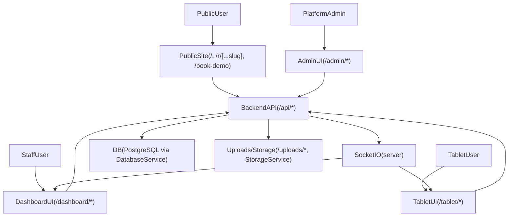
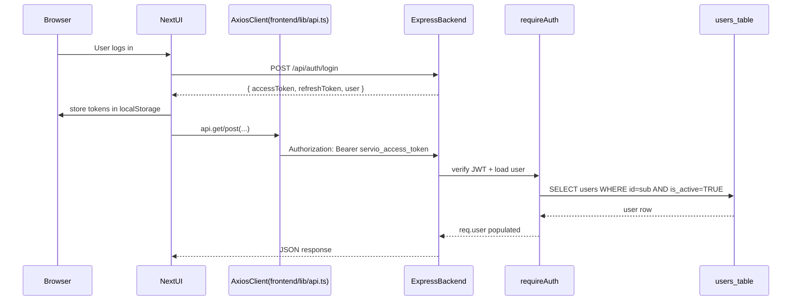
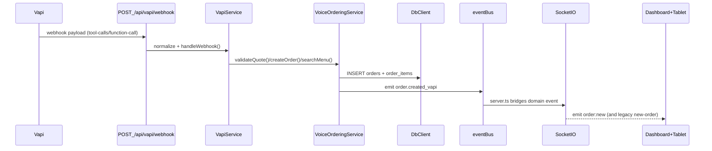
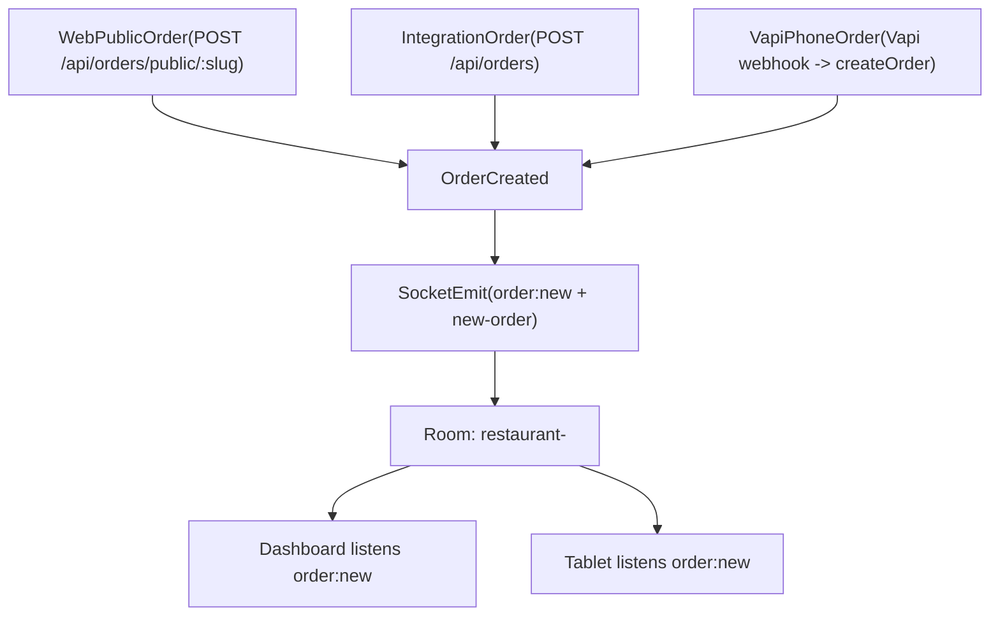

# Servio Hierarchy + Wiring Map

This doc inventories the **frontend pages**, **backend route mounts**, and the **end-to-end wiring** for:
- Menu (dashboard management + public menu + modifiers + availability / “86”)
- Public ordering (`/r/[slug]` → menu → checkout → order creation)
- VAPI phone ordering (webhook → tool dispatch → quote/create order → realtime)
- Dashboard Assistant (audio/text → assistant endpoints → STT/LLM/tools/TTS)
- Realtime orders (Socket.IO → dashboard/tablet + printing/accept flows)

> Note: This file is generated from the engineering plan; the plan file itself is intentionally not modified.

---

## 0) High-level wiring diagrams (quick orientation)

### 0.1 Product surface sitemap (personas)

### 0.2 Auth + request flow (browser → backend)

### 0.3 Vapi phone ordering (webhook → tools → order → realtime)

### 0.4 Realtime orders fan-out (all sources)

## 1) Frontend sitemap (Next.js pages → layout/components → API calls)

### Global app wiring

- **Entrypoint**: `frontend/pages/_app.tsx`
  - Providers: `UserProvider`, `ThemeProvider`, `TourProvider`
  - Global API baseURL: `frontend/lib/api.ts` (Axios; attaches `Authorization: Bearer <token>` from `localStorage.servio_access_token`)
  - Realtime: `frontend/lib/socket.ts` (Socket.IO client; joins `join:user` on connect; pages explicitly join `join:restaurant`)
- **Important**: There are **no** Next.js API routes (`frontend/pages/api/*` is empty).
  - Any `fetch('/api/...')` calls hit the **frontend origin** and will only work if your deployment (or dev proxy/rewrite) routes `/api` to the backend.
  - `fetch('/api/...')` also bypasses the Axios auth interceptor in `frontend/lib/api.ts`, so token/header behavior may differ (some legacy pages also read inconsistent token keys like `token`/`accessToken` vs `servio_access_token`).

### Layouts

- **Dashboard**: `frontend/components/Layout/DashboardLayout.tsx`
  - Auth guard: redirects to `/login` when not authenticated (client-side).
  - Navigation highlights relevant pages (Assistant, Voice Hub, Orders, Menu).
- **Tablet**: `frontend/components/Layout/TabletLayout.tsx`
  - Auth guard: redirects to `/tablet/login` when not authenticated.
- **Admin**: `frontend/components/Layout/AdminLayout.tsx`
  - Hard guard: only `role === 'platform-admin'`, else redirects to `/dashboard`.

### Pages (grouped)

### Complete page inventory (all `frontend/pages/*`)

This is the **full** Next.js page entrypoint list, with the layout and primary backend touchpoints.

| Route | File | Layout | Key API calls / notes |
| --- | --- | --- | --- |
| `/` | `frontend/pages/index.tsx` | none | marketing/landing (no direct API calls found) |
| `/index_new` | `frontend/pages/index_new.tsx` | none | marketing/landing (no direct API calls found) |
| `/book-demo` | `frontend/pages/book-demo.tsx` | none | `POST /api/bookings` |
| `/login` | `frontend/pages/login.tsx` | none | uses `UserContext.login/signup` → `/api/auth/login`, `/api/auth/signup` |
| `/offline` | `frontend/pages/offline.tsx` | none | offline fallback |
| `/r/[...slug]` | `frontend/pages/r/[...slug].tsx` | none | `GET /api/menu/public/:slug`, `POST /api/orders/public/:slug` |
| `/dashboard` | `frontend/pages/dashboard/index.tsx` | `DashboardLayout` | `GET /api/orders`, `GET /api/orders/stats/summary`, `GET /api/tasks/stats`; listens `order:new` |
| `/dashboard/assistant` | `frontend/pages/dashboard/assistant.tsx` | `DashboardLayout` | `POST /api/assistant/process-audio`, `POST /api/assistant/process-text` |
| `/dashboard/assistant-monitoring` | `frontend/pages/dashboard/assistant-monitoring.tsx` | `DashboardLayout` | `GET /api/assistant-monitoring/dashboard-data`, `POST /api/assistant-monitoring/reset` |
| `/dashboard/integrations` | `frontend/pages/dashboard/integrations.tsx` | `DashboardLayout` | `GET /api/integrations`, `POST /api/integrations/:id/toggle` |
| `/dashboard/inventory` | `frontend/pages/dashboard/inventory.tsx` | `DashboardLayout` | `GET /api/inventory/search` |
| `/dashboard/inventory/receipts` | `frontend/pages/dashboard/inventory/receipts.tsx` | `DashboardLayout` | `fetch('/api/receipts/*')` + `fetch('/api/inventory?restaurantId=...')` (**same-origin `/api` dependency**; also mixes token keys like `servio_access_token` vs `accessToken`) |
| `/dashboard/marketing` | `frontend/pages/dashboard/marketing.tsx` | `DashboardLayout` | `GET /api/marketing/analytics`, `/customers`, `/campaigns`; `POST /api/marketing/campaigns`, `/send`, `/customers`, `/customers/import` |
| `/dashboard/menu-management` | `frontend/pages/dashboard/menu-management.tsx` | `DashboardLayout` | `GET /api/menu/categories/all`, `GET /api/menu/items/full`; `POST /api/menu/categories`; `POST/PUT /api/menu/items` (multipart) |
| `/dashboard/order-history` | `frontend/pages/dashboard/order-history.tsx` | `DashboardLayout` | `GET /api/orders/history`, `GET /api/orders/history/stats`, `GET /api/orders/:id`, `GET /api/orders/export?...` |
| `/dashboard/orders` | `frontend/pages/dashboard/orders.tsx` | `DashboardLayout` | `GET /api/orders`, `GET /api/orders/stats/summary`, `GET /api/orders/:id`, `GET /api/restaurants/:id`; `POST /api/orders/:id/status`; emits `order:status_changed` |
| `/dashboard/restaurant-profile` | `frontend/pages/dashboard/restaurant-profile.tsx` | `DashboardLayout` | `fetch('/api/restaurant/profile|theme|links')` (**same-origin `/api` dependency**; uses `localStorage.getItem('token')` which is inconsistent with `servio_access_token`) |
| `/dashboard/settings` | `frontend/pages/dashboard/settings.tsx` | `DashboardLayout` | restaurant settings surfaces: `/api/restaurants/:id/vapi`, `/receipt`, `/alert-settings`, `/test-alert-call`, `/vapi/test`; print-agent discovery `fetch(${agentUrl}/printers)` |
| `/dashboard/staff` | `frontend/pages/dashboard/staff.tsx` | `DashboardLayout` | `GET /api/restaurant/staff`, `GET /api/timeclock/current-staff`, `GET /api/timeclock/stats` |
| `/dashboard/timeclock` | `frontend/pages/dashboard/timeclock.tsx` | `DashboardLayout` | timeclock reads: `/api/timeclock/current-staff`, `/entries`, `/stats`; writes: `/clock-in`, `/clock-out`, `POST /api/timeclock/:endpoint` |
| `/dashboard/voice-hub` | `frontend/pages/dashboard/voice-hub.tsx` | `DashboardLayout` | `GET /api/voice-hub/calls`, `GET /api/voice-hub/stats` |
| `/tablet/login` | `frontend/pages/tablet/login.tsx` | none | `POST /api/auth/login`, `POST /api/auth/pin-login` |
| `/tablet/orders` | `frontend/pages/tablet/orders.tsx` | `TabletLayout` | `GET /api/orders`, `/api/orders/:id`, `/api/restaurants/:id`, `/api/restaurants/:id/receipt`; `POST /api/orders/:id/accept`, `POST /api/orders/:id/status`; listens `order:new`; optional print agent `POST ${agentUrl}/print` |
| `/tablet/history` | `frontend/pages/tablet/history.tsx` | `TabletLayout` | `GET /api/orders/history`, `GET /api/orders/:id` |
| `/tablet/settings` | `frontend/pages/tablet/settings.tsx` | `TabletLayout` | `GET/PUT /api/restaurants/:id/receipt`, `GET/PUT /api/restaurants/:id/alert-settings`, `POST /api/restaurants/:id/test-alert-call`; print-agent discovery `fetch(${agentUrl}/printers)` |
| `/tablet/assistant` | `frontend/pages/tablet/assistant.tsx` | `TabletLayout` | (no direct API calls found; likely reuses assistant components) |
| `/admin` | `frontend/pages/admin/index.tsx` | `AdminLayout` | `GET /api/admin/stats/summary`, `GET /api/admin/activity?limit=25`, `GET /api/admin/campaigns?status=...` |
| `/admin/audit` | `frontend/pages/admin/audit.tsx` | `AdminLayout` | `GET /api/admin/activity?limit=200` |
| `/admin/campaigns` | `frontend/pages/admin/campaigns.tsx` | `AdminLayout` | `GET /api/admin/campaigns?status=...&limit=100` |
| `/admin/demo-bookings` | `frontend/pages/admin/demo-bookings.tsx` | `AdminLayout` | `GET /api/admin/demo-bookings` |
| `/admin/orders` | `frontend/pages/admin/orders.tsx` | `AdminLayout` | `GET` via computed URL (admin order list) |
| `/admin/orders/index` | `frontend/pages/admin/orders/index.tsx` | `AdminLayout` | `GET /api/orders`; listens `notifications.new` |
| `/admin/orders/[id]` | `frontend/pages/admin/orders/[id].tsx` | `AdminLayout` | `GET /api/orders/:id`; `POST /api/voice/orders/:id/accept` |
| `/admin/restaurants` | `frontend/pages/admin/restaurants/index.tsx` | `AdminLayout` | `GET /api/admin/restaurants` |
| `/admin/restaurants/[id]` | `frontend/pages/admin/restaurants/[id].tsx` | `AdminLayout` | `GET /api/admin/restaurants/:id`; also surfaces `/api/restaurants/:id/vapi`, `/vapi/test` |
| `/admin/system-health` | `frontend/pages/admin/system-health.tsx` | `AdminLayout` | `GET /api/admin/system/health`, `GET /api/admin/jobs?status=failed&limit=20` |

#### Public ordering

- **`/r/[...slug]`** → `frontend/pages/r/[...slug].tsx`
  - **Layout**: none (standalone public page)
  - **Reads**:
    - `GET /api/menu/public/:restaurantSlug`
  - **Writes**:
    - `POST /api/orders/public/:restaurantSlug` with `{ items: [{id,name,quantity,price}], customerName: "Guest" }`

#### Dashboard (restaurant operator UI)

- **`/dashboard`** → `frontend/pages/dashboard/index.tsx`
  - **Layout**: `DashboardLayout`
  - **Reads**:
    - `GET /api/orders?limit=5`
    - `GET /api/orders/stats/summary`
    - `GET /api/tasks/stats`
  - **Realtime**:
    - subscribes `socket.on('order:new', ...)` and refetches stats

- **`/dashboard/orders`** → `frontend/pages/dashboard/orders.tsx`
  - **Layout**: `DashboardLayout`
  - **Reads**:
    - `GET /api/orders` (filters: `status`, `channel`, `limit`, `offset`)
    - `GET /api/orders/stats/summary`
    - `GET /api/orders/:id` (details modal)
    - `GET /api/restaurants/:restaurantId` (slug for “Test Ordering” link)
  - **Writes**:
    - `POST /api/orders/:id/status` (status updates)
  - **Realtime (client->server)**:
    - emits `socket.emit('order:status_changed', { orderId, status, timestamp })` (note: backend still needs to treat the HTTP write as source-of-truth)

- **`/dashboard/menu-management`** → `frontend/pages/dashboard/menu-management.tsx`
  - **Layout**: `DashboardLayout`
  - **Reads**:
    - `GET /api/menu/categories/all`
    - `GET /api/menu/items/full`
  - **Writes**:
    - `POST /api/menu/categories`
    - `POST /api/menu/items` (multipart/form-data)
    - `PUT /api/menu/items/:id` (multipart/form-data; includes `existingImages`)
  - **Note**: availability toggle in UI maps to `is_available` field on items, but this page currently updates availability only via full item update.

- **`/dashboard/assistant`** → `frontend/pages/dashboard/assistant.tsx`
  - **Layout**: `DashboardLayout`
  - **Audio capture**: `MediaRecorder` with best-effort mime type (`audio/webm;codecs=opus` → `audio/webm` → `audio/mp4`)
  - **Reads/Writes**:
    - `POST /api/assistant/process-audio` (multipart; `audio` + `userId`)
    - `POST /api/assistant/process-text` (`{ text, userId }`)
  - **Returned payload contract (frontend expectation)**:
    - `{ transcript, response, actions, audioUrl, confidence?, processingTime? }`
  - **Playback**:
    - `audioUrl` is treated as a backend-served relative path (e.g. `/uploads/...`) and expanded to absolute URL.

- **`/dashboard/voice-hub`** → `frontend/pages/dashboard/voice-hub.tsx`
  - **Layout**: `DashboardLayout`
  - **Reads**:
    - `GET /api/voice-hub/calls` (query: `dateRange`, `statusFilter`, `search`)
    - `GET /api/voice-hub/stats` (query: `dateRange`)

- **`/dashboard/settings`** → `frontend/pages/dashboard/settings.tsx`
  - **Layout**: `DashboardLayout`
  - **Reads/Writes** (restaurant-config surfaces for VAPI + printing/alerts):
    - `GET /api/restaurants/:restaurantId/vapi`
    - `PUT /api/restaurants/:restaurantId/vapi`
    - `POST /api/restaurants/:restaurantId/vapi/test`
    - `GET /api/restaurants/:restaurantId/receipt`
    - `PUT /api/restaurants/:restaurantId/receipt`
    - `GET /api/restaurants/:restaurantId/alert-settings`
    - `PUT /api/restaurants/:restaurantId/alert-settings`
    - `POST /api/restaurants/:restaurantId/test-alert-call`
    - (print-agent discovery) `fetch(${agentUrl}/printers)`

#### Tablet (kitchen UI)

- **`/tablet/login`** → `frontend/pages/tablet/login.tsx`
  - **Layout**: none (standalone)
  - **Writes**:
    - `POST /api/auth/login`
    - `POST /api/auth/pin-login` (payload includes `restaurantSlug`, `pin`)
  - **Storage side-effects**: sets `servio_access_token`, `servio_refresh_token`, `servio_user`, and `servio_tablet_restaurant_slug`

- **`/tablet/orders`** → `frontend/pages/tablet/orders.tsx`
  - **Layout**: `TabletLayout`
  - **Reads**:
    - `GET /api/orders?limit=50&offset=0`
    - `GET /api/orders/:id` (details modal + printing)
    - `GET /api/restaurants/:restaurantId` (slug for “Preview & Test Ordering” link)
    - `GET /api/restaurants/:restaurantId/receipt` (printing config)
  - **Writes**:
    - `POST /api/orders/:id/accept` (payload `{ prepTimeMinutes }`)
    - `POST /api/orders/:id/status` (decline sets `status: 'cancelled'`)
  - **Realtime**:
    - joins restaurant room: `socket.joinRestaurantRoom(user.restaurantId)`
    - listens `socket.on('order:new', ...)` → refetch + optional auto-print
  - **Printing**:
    - browser print via `window.open()` + HTML ticket
    - optional print-agent mode: `POST ${agentUrl}/print`

---

## 2) Backend API map (mounts → handlers → services → repositories/db)

### 2.1 Route mounts (single source of truth)

All routers are mounted in `backend/src/server.ts` (see `initializeServer()` around the route registration block).

- **Unauthenticated / special**
  - `GET /health` and `GET /api/health` → `backend/src/routes/health.ts`
  - `POST /api/setup/*` → `backend/src/routes/setup.ts` (bootstrap/setup)
  - `POST /api/auth/*` → `backend/src/routes/auth.ts` (guarded by `authRateLimiter`)
  - `POST /api/vapi/webhook` + `GET /api/vapi/assistant-config` → `backend/src/routes/vapi.ts` (**no `requireAuth`**, external webhook)
  - `GET/POST /api/voice/*` → `backend/src/routes/voice.ts` (**mixed auth**: most endpoints require `requireVapiAuth`; staff actions like accept/cancel/complete use `requireAuth`)
  - `GET /api/bookings` + `POST /api/bookings` → `backend/src/routes/bookings.ts` (**public demo booking**)

- **Authenticated** (all mounted with `requireAuth` in `server.ts`, plus per-surface rate limiting)
  - Platform admin: `GET /api/admin/*` → `backend/src/routes/admin.ts` (also enforces `requirePlatformAdmin`)
  - Assistant: `POST/GET /api/assistant/*` → `backend/src/routes/assistant.ts` (`heavyOperationRateLimiter`)
  - Assistant monitoring: `GET/POST /api/assistant-monitoring/*` → `backend/src/routes/assistant-monitoring.ts` (`apiRateLimiter`)
  - Orders: `GET/POST /api/orders/*` → `backend/src/routes/orders.ts` (`apiRateLimiter`)
  - Order history: `GET /api/orders/history/*` → `backend/src/routes/order-history.ts` (`apiRateLimiter`)
  - Inventory: `GET/POST /api/inventory/*` → `backend/src/routes/inventory.ts` (`apiRateLimiter`)
  - Receipts: `GET/POST /api/receipts/*` → `backend/src/routes/receipts.ts` (`apiRateLimiter`)
  - Menu: `GET/POST /api/menu/*` → `backend/src/routes/menu.ts` (`apiRateLimiter`)
  - Tasks: `GET/POST /api/tasks/*` → `backend/src/routes/tasks.ts` (`apiRateLimiter`)
  - Sync (delivery platform availability sync demo): `GET/POST /api/sync/*` → `backend/src/routes/sync.ts` (`apiRateLimiter`)
  - Audit logs: `GET/POST /api/audit/*` → `backend/src/routes/audit.ts` (`apiRateLimiter`)
  - Time clock: `GET/POST /api/timeclock/*` → `backend/src/routes/timeclock.ts` (`apiRateLimiter`)
  - Marketing: `GET/POST /api/marketing/*` → `backend/src/routes/marketing.ts` (`apiRateLimiter`)
  - Restaurant profile/theme/links: `GET/PUT /api/restaurant/*` → `backend/src/routes/restaurant.ts` (`apiRateLimiter`)
  - Restaurant settings (Vapi/printing/alerts/menu page settings): `GET/PUT /api/restaurants/*` → `backend/src/routes/restaurant-settings.ts` (`apiRateLimiter`)
  - Integrations registry: `GET/POST /api/integrations/*` → `backend/src/routes/integrations.ts` (`apiRateLimiter`)
  - Notifications: `GET/POST /api/notifications/*` → `backend/src/routes/notifications.ts` (`apiRateLimiter`)
  - Voice hub analytics: `GET /api/voice-hub/*` → `backend/src/routes/voice-hub.ts` (`apiRateLimiter`)

### 2.2 Menu routes → DB tables

**Router:** `backend/src/routes/menu.ts`

- **Public menu for `/r/[slug]`**
  - `GET /api/menu/public/:slug` (≈ `menu.ts:47-85`)
  - **DB**:
    - `restaurants` (lookup by `slug`, `is_active`)
    - `menu_items` + `menu_categories` (only `mi.is_available = TRUE` and `mc.is_active = TRUE`)

- **Dashboard menu management**
  - `GET /api/menu/categories/all` (≈ `menu.ts:91-113`)
    - **DB**: `menu_categories` (+ `COUNT(*) FROM menu_items WHERE category_id = ...`)
  - `POST /api/menu/categories` (≈ `menu.ts:115-141`)
    - **DB**: `menu_categories`
    - **Audit**: `audit_logs` via `DatabaseService.logAudit(...)`
  - `GET /api/menu/items/full` (≈ `menu.ts:437-483`)
    - **DB**: `menu_items` + `menu_categories`
  - `POST /api/menu/items` (≈ `menu.ts:203-299`) (multipart image upload → `/uploads/menu/*`)
    - **DB**: `menu_items`
    - **Filesystem**: writes to `uploads/menu`, served by `backend/src/server.ts` at `app.use('/uploads', express.static(...))`
    - **Audit**: `audit_logs`
  - `PUT /api/menu/items/:id` (≈ `menu.ts:305-431`) (multipart, supports `existingImages`)
    - **DB**: `menu_items`
    - **Audit**: `audit_logs`

- **Availability (“86”)**
  - `POST /api/menu/items/set-unavailable` (≈ `menu.ts:547-617`)
  - `POST /api/menu/items/set-available` (≈ `menu.ts:623-693`)
  - `GET /api/menu/unavailable` (≈ `menu.ts:699-719`)
  - **DB**:
    - `menu_items` (`is_available`, `updated_at`)
    - `sync_jobs` (simulated per-channel sync records)
    - `audit_logs`

- **Modifiers**
  - `GET /api/menu/modifier-groups` (≈ `menu.ts:760-823`)
  - `POST /api/menu/modifier-groups` (≈ `menu.ts:785-823`)
  - `GET /api/menu/modifier-groups/:id/options` (≈ `menu.ts:829-843`)
  - `POST /api/menu/modifier-groups/:id/options` (≈ `menu.ts:849-885`)
  - `GET /api/menu/items/:id/modifiers` (≈ `menu.ts:891-929`)
  - `POST /api/menu/items/:id/modifiers` (≈ `menu.ts:935-982`)
  - **DB**:
    - `modifier_groups`, `modifier_options`, `menu_item_modifiers`
    - `audit_logs`

- **Bulk import**
  - `POST /api/menu/import` (≈ `menu.ts:992-1139`)
  - `GET /api/menu/imports` (≈ `menu.ts:1145-1163`)
  - **DB**:
    - `menu_imports`, `menu_categories`, `menu_items`
    - `audit_logs`

### 2.3 Orders routes → services/repos → DB tables

**Router:** `backend/src/routes/orders.ts`

- `GET /api/orders` (≈ `orders.ts:15-33`)
  - **Service**: `OrderService.listOrders(...)` → `OrderRepository.findByRestaurant(...)`
  - **DB**: `orders` + `order_items`

- `GET /api/orders/stats/summary` (≈ `orders.ts:40-49`)
  - **Service**: `OrderService.getStatsSummary(...)` → `OrderRepository.getStatsSummary(...)`
  - **DB**: `orders` (aggregations)

- `POST /api/orders/public/:slug` (≈ `orders.ts:71-97`)
  - **Service**: `OrderService.createPublicOrder(...)`
  - **DB**: `restaurants`, `orders`, `order_items` (supports “extended schema” columns when present)
  - **Realtime**: emits Socket.IO to `restaurant-<id>`: both `new-order` (legacy) and `order:new` (canonical)

- `POST /api/orders` (≈ `orders.ts:104-151`) (integration orders)
  - **Service**: `OrderService.createIntegrationOrder(...)`
  - **DB**: `orders` (and best-effort `order_items` if `orders.items` column absent)
  - **Realtime**: emits `new-order` + `order:new`

- `GET /api/orders/:id` (≈ `orders.ts:158-167`)
  - **Service**: `OrderService.getOrderById(...)` → `OrderRepository.findById(...)`
  - **DB**: `orders` + `order_items`

- `POST /api/orders/:id/status` (≈ `orders.ts:174-187`)
  - **Service**: `OrderService.updateOrderStatus(...)` → `OrderRepository.updateStatus(...)`
  - **DB**: `orders`
  - **Audit**: `audit_logs`
  - **Events**: emits `order.status_changed` on `eventBus` (note: Socket.IO broadcasting of status changes is not done here—client currently emits `order:status_changed` itself)

- `POST /api/orders/:id/accept` (≈ `orders.ts:194-243`)
  - **Service**: `OrderService.updateOrderStatus(... status='preparing')` plus direct SQL update
  - **DB**: `orders` (`prep_time_minutes`, `accepted_at`, `accepted_by_user_id`)

**Repository:** `backend/src/repositories/OrderRepository.ts`

- `findByRestaurant` loads `orders` then bulk-loads `order_items` by `order_id`.
- `mapOrder` normalizes either legacy (`order_items.quantity`, `order_items.unit_price`) or voice schema (`qty`, `unit_price_snapshot`, `modifiers_json`).

### 2.4 Assistant routes → service → DB tables

**Router:** `backend/src/routes/assistant.ts`

- `POST /api/assistant/process-audio` (≈ `assistant.ts:94-195`)
  - **Service**: `AssistantService.processAudio(buffer, userId)` → OpenAI Whisper STT → LLM tool calls → TTS → writes `uploads/tts/*.mp3`
  - **DB (context + tools)**: reads `users`, `orders`, `order_items`, `menu_items`, `inventory_items`, `tasks`, `modifier_groups`/`modifier_options` (depending on tool)

- `POST /api/assistant/process-text` (≈ `assistant.ts:201-305`)
  - **Service**: `AssistantService.processText(text, userId)` (same tool path as audio)

- `GET /api/assistant/status|health|tools` (≈ `assistant.ts:306+`)
  - Health/config surface for UI + monitoring.

**Service:** `backend/src/services/AssistantService.ts`

- **STT**: OpenAI Whisper (`openai.audio.transcriptions.create(...)`)
- **LLM**: `gpt-4o-mini` with tool calls
- **TTS**: OpenAI `tts-1` → `/uploads/tts/...mp3`
- **DB context cache**: queries `orders`, `menu_items`, `inventory_items`, `tasks` (and user’s `restaurant_id`), plus modifier queries for menu details tools.

### 2.5 VAPI routes → service → DB tables

**Router:** `backend/src/routes/vapi.ts`

- `POST /api/vapi/webhook` (≈ `vapi.ts:123-184`)
  - **Service**: `VapiService.handleWebhook(...)`
  - **Payload normalization**: supports Vapi `tool-calls` shape → normalized into `message.type='function-call'`
  - **DB** (indirect):
    - resolves restaurant by `restaurants.settings.vapi.phoneNumberId` (see `VapiService.getRestaurantIdFromCall`)
    - writes call audits to `audit_logs` (`phone_conversation_update`, `phone_call_ended`, etc.)
    - order creation via `VoiceOrderingService.createOrder(...)` writes `orders` + `order_items` and emits `order.created_vapi`

- `GET /api/vapi/assistant-config` (≈ `vapi.ts:186-336`)
  - returns the **Vapi Assistant** function schema (includes `quoteOrder`, `createOrder`, `searchMenu`, etc.)

**Service:** `backend/src/services/VapiService.ts`

- **Restaurant routing**: iterates active restaurants and matches `settings.vapi.phoneNumberId` (JSON in `restaurants.settings`)
- **Functions**:
  - menu lookup + order actions delegated to `VoiceOrderingService`
  - tool-call responses returned either as `{ result }` or `{ results: [{ toolCallId, result }] }` depending on Vapi format

### 2.6 Voice Hub routes → DB tables

**Router:** `backend/src/routes/voice-hub.ts`

- `GET /api/voice-hub/calls` (≈ `voice-hub.ts:114-248`)
  - **DB**: joins `restaurants` ↔ `alert_calls` ↔ `orders` (where `source='phone'`) ↔ `audit_logs` (call-ish actions)
  - Produces consolidated call log rows used by the dashboard.

- `GET /api/voice-hub/stats` (≈ `voice-hub.ts:253-351`)
  - **DB**: aggregates across `alert_calls`, `orders`, `audit_logs`

- `GET /api/voice-hub/export` (≈ `voice-hub.ts:356-442`)
  - **DB**: exports consolidated call rows to CSV.

### 2.7 Voice Ordering REST helpers (“Voice API”)

**Router:** `backend/src/routes/voice.ts`

These are **Bearer-protected helper endpoints** used by Vapi tooling or internal admin flows:
- `GET /api/voice/store/status` (requires `requireVapiAuth`) → `VoiceOrderingService.getStoreStatus()`
- `GET /api/voice/menu` (requires `requireVapiAuth`) → `VoiceOrderingService.getFullMenu()` (static JSON)
- `GET /api/voice/menu/search` (requires `requireVapiAuth`) → `VoiceOrderingService.searchMenu(q, restaurantId)` (DB-first)
- `GET /api/voice/menu/items/:id` (requires `requireVapiAuth`) → `VoiceOrderingService.getMenuItem(id, restaurantId)` (DB-first; loads modifiers)
- `POST /api/voice/order/quote` (requires `requireVapiAuth`) → `VoiceOrderingService.validateQuote(...)`
- `POST /api/voice/orders` (requires `requireVapiAuth`) → `VoiceOrderingService.createOrder(...)` (creates `orders` + `order_items` + emits `order.created_vapi`)
- `POST /api/voice/orders/:id/accept` (requires `requireAuth`) → `VoiceOrderingService.acceptOrder(...)` (note: this currently expects `status === 'pending'`, which differs from the main orders flow)
- `POST /api/voice/calls/log` (requires `requireVapiAuth`) → `VoiceOrderingService.logCall(...)` (writes `call_logs`)

### 2.8 Restaurant profile/theme/links routes → DB tables

**Router:** `backend/src/routes/restaurant.ts` (mounted at `/api/restaurant` in `backend/src/server.ts`)

These endpoints power the Dashboard “Restaurant Profile” and “Staff” screens.

- **Staff**
  - `GET /api/restaurant/staff`
  - **DB**: `users` filtered by `restaurant_id`

- **Restaurant profile**
  - `GET /api/restaurant/profile`
    - **DB**: `restaurants` (parses JSON columns like `address`, `settings`, `operating_hours`)
  - `PUT /api/restaurant/profile` (multipart; `logo`, `coverImage`)
    - **Filesystem**: writes to `uploads/restaurants/*` (served at `/uploads/*`)
    - **DB**: `restaurants` updates + audit log

- **Theme**
  - `GET /api/restaurant/theme`
  - `PUT /api/restaurant/theme`
  - **DB**: `restaurant_themes` (one active theme per restaurant)

- **Public links + QR**
  - `GET /api/restaurant/links`
  - `POST /api/restaurant/links`
  - `PUT /api/restaurant/links/:id`
  - `DELETE /api/restaurant/links/:id`
  - `POST /api/restaurant/links/:id/click` (increments click count)
  - **DB**: `restaurant_links`, `analytics_events` (click tracking)
  - **Filesystem**: QR codes written to `uploads/restaurants/qr-codes/*`

### 2.9 Restaurant settings (Vapi/printing/alerts/menu page settings) → DB tables

**Router:** `backend/src/routes/restaurant-settings.ts` (mounted at `/api/restaurants`)

These endpoints back **Dashboard Settings** and **Tablet Settings**. All are `requireAuth` and enforce a tenant check:
`req.user.restaurantId === :restaurantId` OR `req.user.role === 'platform-admin'`.

- **Vapi settings**
  - `GET /api/restaurants/:restaurantId/vapi`
  - `PUT /api/restaurants/:restaurantId/vapi`
  - `POST /api/restaurants/:restaurantId/vapi/test` (calls Vapi API to validate phone number)
  - `GET /api/restaurants/:restaurantId/vapi/webhook-url` (returns computed webhook URL)
  - **DB**: `restaurants.settings` JSON under `settings.vapi` (API key + phone mapping)

- **Receipt / printing settings**
  - `GET /api/restaurants/:restaurantId/receipt`
  - `PUT /api/restaurants/:restaurantId/receipt`
  - **DB**: `restaurants.settings` JSON under `settings.receipt`

- **Alert call settings**
  - `GET /api/restaurants/:restaurantId/alert-settings`
  - `PUT /api/restaurants/:restaurantId/alert-settings`
  - `POST /api/restaurants/:restaurantId/test-alert-call`
  - **DB**: `restaurants.settings` JSON under `settings.alerts`
  - **Calls out to**: `AlertService` (Twilio)

- **Public menu page settings**
  - `GET /api/restaurants/:restaurantId/menu-settings`
  - `PUT /api/restaurants/:restaurantId/menu-settings`
  - **DB**: `restaurants.settings` JSON under `settings.menu`

### 2.10 Inventory routes → services → DB tables

**Router:** `backend/src/routes/inventory.ts` (mounted at `/api/inventory`)

- `GET /api/inventory/search` (`inventory:read`)
  - **Service**: `InventoryService.searchInventory(...)` → `InventoryRepository.search(...)`
  - **DB**: `inventory_items` (+ categories joins depending on repo query)
- `POST /api/inventory/receive` (`inventory:write`)
  - **Service**: `InventoryService.receiveInventory(...)`
  - **DB**: `inventory_items`, `inventory_transactions`, `audit_logs`
- `POST /api/inventory/adjust` (`inventory:write`)
  - **Service**: `InventoryService.adjustInventory(...)`
  - **DB**: `inventory_items`, `inventory_transactions`, `audit_logs`
- `GET /api/inventory/low-stock` (`inventory:read`)
  - **Service**: `InventoryService.listLowStock(...)`
  - **DB**: `inventory_items`
- `GET /api/inventory/categories` (`inventory:read`)
  - **Service**: `InventoryService.listCategories(...)`
  - **DB**: `inventory_categories`

### 2.11 Receipts routes (inventory invoices) → DB tables

**Router:** `backend/src/routes/receipts.ts` (mounted at `/api/receipts`)

This supports `/dashboard/inventory/receipts` and is designed for object storage uploads + later parsing/matching.

- `POST /api/receipts/create-upload`
  - **Storage**: `StorageService.getUploadUrl(storageKey, contentType)`
  - **DB**: `receipts` initial row with `status='pending'`
  - **Audit**: `audit_logs` (`receipt_upload_initiated`)
- `POST /api/receipts/:id/confirm-upload`
  - **DB**: `receipts` → `status='needs_review'`, sets supplier/amount
  - **Events**: `eventBus.emit('receipt.uploaded', ...)`
  - **Audit**: `audit_logs` (`receipt_upload_confirmed`)
- `GET /api/receipts/list`
  - **DB**: `receipts` filtered by restaurant
  - **Storage**: generates a 1-hour preview URL per receipt (`StorageService.getDownloadUrl`)
- `GET /api/receipts/:id`
  - **Storage**: generates a fresh 1-hour download URL
- `GET /api/receipts/:id/items`
  - **DB**: `receipt_line_items` LEFT JOIN `inventory_items` for match display
- `POST /api/receipts/:id/items`
  - **DB**: inserts into `receipt_line_items` (manual line item add)
- `POST /api/receipts/:id/apply`
  - **DB**:
    - inserts into `inventory_transactions` (type `'receive'`)
    - increments `inventory_items.on_hand_qty`
    - updates `receipts.status='processed'`
  - **Events**: `eventBus.emit('receipt.applied', ...)`
  - **Audit**: `audit_logs` (`receipt_applied_to_inventory`)

### 2.12 Tasks routes → DB tables

**Router:** `backend/src/routes/tasks.ts` (mounted at `/api/tasks`)

- `GET /api/tasks/today` (daily + due-today + incomplete one-time tasks)
- `GET /api/tasks` (filter by `status`, `type`, `assignedTo`)
- `POST /api/tasks` (creates a task)
- `POST /api/tasks/:id/start` (moves `pending` → `in_progress`)
- `POST /api/tasks/:id/complete` (marks completed)
- `GET /api/tasks/stats`
- **DB**: `tasks` (+ audit logs). Emits `task.created` and `task.completed` on `eventBus`.

### 2.13 Timeclock routes → DB tables

**Router:** `backend/src/routes/timeclock.ts` (mounted at `/api/timeclock`)

- `POST /api/timeclock/clock-in` (supports `userId` or `pin`)
- `POST /api/timeclock/clock-out` (supports `userId` or `pin`)
- `POST /api/timeclock/start-break`
- `POST /api/timeclock/end-break`
- `GET /api/timeclock/current-staff`
- `GET /api/timeclock/entries`
- `PUT /api/timeclock/entries/:id` (edit entry)
- `GET /api/timeclock/stats`
- **DB**: `time_entries`, `time_entry_breaks`, `users`, `audit_logs`
- **Events**: emits `staff.clock_in`, `staff.clock_out`, `staff.break_start`, `staff.break_end`

### 2.14 Integrations routes → DB tables

**Router:** `backend/src/routes/integrations.ts` (mounted at `/api/integrations`)

- `GET /api/integrations` (search/status + pagination)
- `GET /api/integrations/:id`
- `POST /api/integrations`
- `PUT /api/integrations/:id`
- `POST /api/integrations/:id/toggle`
- `POST /api/integrations/:id/sync`
- `DELETE /api/integrations/:id`
- `POST /api/integrations/:id/test`
- **DB**: `integrations` (note: several responses are not wrapped in `{ success: true, data: ... }`, unlike most other routers)

### 2.15 Marketing routes → DB tables + external services

**Router:** `backend/src/routes/marketing.ts` (mounted at `/api/marketing`)

- **Customers**
  - `GET /api/marketing/customers`
  - `POST /api/marketing/customers` (upsert)
  - `POST /api/marketing/customers/import` (CSV/XLSX; multer upload; uses DB transaction)
  - **DB**: `customers`, `audit_logs`
- **Campaigns**
  - `GET /api/marketing/campaigns`
  - `POST /api/marketing/campaigns`
  - `POST /api/marketing/campaigns/:id/send`
  - **DB**: `marketing_campaigns`, `marketing_sends`, `audit_logs`
  - **Async send**: `setImmediate(() => sendCampaign(...))` (in production this should be a job queue)
- **Direct send**
  - `POST /api/marketing/send-sms` (Twilio)
  - `POST /api/marketing/send-email` (SMTP via Nodemailer)
- **Analytics**
  - `GET /api/marketing/analytics`

### 2.16 Notifications routes → DB tables + Socket.IO

**Router:** `backend/src/routes/notifications.ts` (mounted at `/api/notifications`)

- `GET /api/notifications?limit=...` (joins recipients + read status)
- `POST /api/notifications/:id/read` (marks read and emits `notifications.unread_count.updated` to `user-<id>`)
- `POST /api/notifications/read-all` (bulk mark read; emits unread count update)
- **DB**: `notifications`, `notification_recipients`, `notification_reads`

### 2.17 Audit routes → DB tables

**Router:** `backend/src/routes/audit.ts` (mounted at `/api/audit`)

- `GET /api/audit/logs` (filters: `userId`, `action`, `entityType`, `source`, date range; paginated)
- `GET /api/audit/actions`
- `GET /api/audit/users`
- `GET /api/audit/stats?period=today|week|month`
- `GET /api/audit/entity/:entityType/:entityId`
- `POST /api/audit/export` + `GET /api/audit/download/:exportId` (export is mocked)
- **DB**: `audit_logs`

### 2.18 Sync routes → DB tables

**Router:** `backend/src/routes/sync.ts` (mounted at `/api/sync`)

- `GET /api/sync/jobs/:id`
- `GET /api/sync/status`
- `POST /api/sync/manual`
- `GET /api/sync/history`
- **DB**: `sync_jobs` (this module is largely a demo/simulator; menu “86” also inserts rows into `sync_jobs`)

### 2.19 Bookings routes (public) → DB tables

**Router:** `backend/src/routes/bookings.ts` (mounted at `/api/bookings`, no auth)

- `GET /api/bookings?start=YYYY-MM-DD&end=YYYY-MM-DD` → returns booked slots
- `POST /api/bookings` → creates booking
- **DB**: `demo_bookings`

### 2.20 Assistant monitoring routes → monitoring service

**Router:** `backend/src/routes/assistant-monitoring.ts` (mounted at `/api/assistant-monitoring`)

- `GET /api/assistant-monitoring/metrics`
- `GET /api/assistant-monitoring/health`
- `GET /api/assistant-monitoring/report`
- `GET /api/assistant-monitoring/dashboard-data`
- `POST /api/assistant-monitoring/reset` (restricted in prod unless `platform:admin`)

### 2.21 Admin routes (platform admin only) → DB tables

**Router:** `backend/src/routes/admin.ts` (mounted at `/api/admin`, and enforces `requirePlatformAdmin` for all routes)

These endpoints back the `/admin/*` pages and provide platform-wide visibility across restaurants.

- `GET /api/admin/stats/summary`
- `GET /api/admin/demo-bookings`
- `GET /api/admin/platform-stats`
- `GET /api/admin/restaurants` and `GET /api/admin/restaurants/:id`
- `GET /api/admin/restaurants/:id/orders`
- `GET /api/admin/restaurants/:id/voice-activity`
- `GET /api/admin/restaurants/:id/inventory-transactions`
- `GET /api/admin/restaurants/:id/timeclock`
- `GET /api/admin/restaurants/:id/audit-logs`
- `GET /api/admin/activity`
- `GET /api/admin/campaigns` (+ `GET /api/admin/campaigns/:id`)
- `GET /api/admin/orders`
- `GET /api/admin/system/health`
- `GET /api/admin/jobs`
- **DB**: reads across `restaurants`, `orders`, `marketing_campaigns`, `time_entries`, `sync_jobs`, `audit_logs`, etc.

---

## 3) Menu wiring (deep)

This section maps **Dashboard menu management**, **Public menu**, **Modifiers**, and **86 availability** end-to-end.

### 3.1 Data model (tables + key columns)

**Core menu tables**

- `menu_categories`
  - `id`, `restaurant_id`, `name`, `description`, `sort_order`, `is_active`
  - plus: `image`, `image_alt_text` (migration `003_menu_enhancements.sql`)

- `menu_items`
  - `id`, `restaurant_id`, `category_id`, `name`, `description`, `price`, `is_available`
  - plus (migration `002_marketing_and_profiles.sql`):
    - `images` (JSON array of URLs like `/uploads/menu/<file>.webp`)
    - `allergens` (JSON array)
    - `nutritional_info` (JSON object)
    - `preparation_time`, `sort_order`, `cost`, `sku`, `category` (legacy)
    - `channel_availability` (JSON object)
  - plus: `tags` (JSON array; migration `011_voice_ordering.sql`)

**Modifiers**

- `modifier_groups`
  - `id`, `restaurant_id`, `name`, `min_selection`, `max_selection`, `is_required`
  - plus: `description`, `sort_order`, `is_active`, `updated_at` (migration `003_menu_enhancements.sql`)
- `modifier_options`
  - `id`, `modifier_group_id`, `name`, `price_modifier`, `is_available`
  - plus: `description`, `sort_order`, `updated_at` (migration `003_menu_enhancements.sql`)
- `menu_item_modifiers` (many-to-many)
  - `menu_item_id`, `modifier_group_id`, `sort_order`

**Availability sync + audit**

- `sync_jobs` / `sync_job_runs` (migration `008_schema_completion.sql` enhances/normalizes; menu routes currently insert simplified sync rows)
- `audit_logs` (all menu mutations log audit)

### 3.2 Dashboard menu management flow (categories/items/images)

**Page:** `/dashboard/menu-management` → `frontend/pages/dashboard/menu-management.tsx`

**Read path**

1) Page loads and calls in parallel:
   - `GET /api/menu/categories/all`
   - `GET /api/menu/items/full`
2) Backend responds from `backend/src/routes/menu.ts`:
   - categories: `menu_categories` (filtered to `is_active = TRUE`)
   - items: `menu_items` joined with `menu_categories`, ordered by `category_sort_order` then `item.sort_order`
3) Frontend merges `categories` + `items` into a “categoryMap” UI model and defaults categories to expanded.

**Write path (create/update)**

- **Create category**
  - UI: `POST /api/menu/categories` with `{ name, description, sortOrder }`
  - Backend: inserts `menu_categories` and writes `audit_logs` (`create_category`)

- **Create item**
  - UI: `POST /api/menu/items` as `multipart/form-data` (field name `images`)
  - Backend: `multer` (memory storage) → `sharp` → writes `.webp` into `uploads/menu/`
  - DB: inserts `menu_items.images = JSON.stringify(['/uploads/menu/<file>.webp', ...])`
  - Audit: `audit_logs` (`create_menu_item`)

- **Update item (including availability)**
  - UI: `PUT /api/menu/items/:id` multipart, includes `existingImages` JSON and optionally `images`
  - Backend: merges new + existing images and updates `menu_items`, sets `updated_at`
  - Audit: `audit_logs` (`update_menu_item`)

**Important: two different “availability” write paths**

- Dashboard UI updates availability via `PUT /api/menu/items/:id` (writes `menu_items.is_available`)
- There is also a dedicated “86 endpoints” pair:
  - `POST /api/menu/items/set-unavailable`
  - `POST /api/menu/items/set-available`
  These **also** write `menu_items.is_available` but additionally create `sync_jobs` rows and audit entries.

### 3.3 Public menu flow (`/r/[slug]`)

**Page:** `/r/[...slug]` → `frontend/pages/r/[...slug].tsx`

1) Browser calls `GET /api/menu/public/:slug`
2) Backend (`backend/src/routes/menu.ts`) resolves:
   - `restaurants` by `slug` where `is_active = TRUE`
3) It returns:
   - `restaurant`: `{ id, name, slug, logoUrl, settings }`
   - `items`: all `menu_items` for that restaurant where:
     - `menu_items.is_available = TRUE`
     - `menu_categories.is_active = TRUE`
4) Frontend renders category sections by grouping on `category_name`.

**Notable constraints**

- Public endpoint currently returns **items only** (no modifier groups/options). If/when you add public modifiers selection, you’ll want to:
  - either add `GET /api/menu/public/:slug/items/:id/modifiers`
  - or include modifiers in the `public/:slug` payload.

### 3.4 Modifiers flow (create → assign → consumption)

**Create + manage**

- Modifier group:
  - `POST /api/menu/modifier-groups`
  - stored in `modifier_groups` (with min/max/required semantics)
- Modifier option:
  - `POST /api/menu/modifier-groups/:id/options`
  - stored in `modifier_options` (`price_modifier` drives price deltas)
- Assign groups to an item:
  - `POST /api/menu/items/:id/modifiers` with `{ modifierGroupIds: [...] }`
  - implemented as a transaction that rewrites `menu_item_modifiers` for that item

**Read back**

- `GET /api/menu/items/:id/modifiers` returns each modifier group plus a JSON array of options.

**Consumption (voice + assistant)**

- Phone ordering uses DB modifiers at order time:
  - `VoiceOrderingService.getMenuItem(...)` loads modifier groups via `loadModifiersForItem(...)`
  - `validateQuote(...)` enforces required groups and resolves option names/ids into a normalized modifier map keyed by `modifier_group.id`
- Orders persist modifier selections into:
  - `order_items.modifiers_json` (migration `011_voice_ordering.sql`)

### 3.5 Availability (“86”) flow end-to-end

There are three consumers of `menu_items.is_available`:

1) **Public ordering**: filters to only available items.
2) **Voice ordering**: `VoiceOrderingService.searchMenu(...)` and `getMenuItem(...)` filter out unavailable items.
3) **Dashboard**: menu management UI displays availability and can toggle it.

**Dedicated 86 endpoints**

- `POST /api/menu/items/set-unavailable`:
  - sets `menu_items.is_available = FALSE`
  - creates one `sync_jobs` row per channel (simulated)
  - logs `audit_logs` action `set_item_unavailable`
- `POST /api/menu/items/set-available`:
  - sets `menu_items.is_available = TRUE`
  - creates one `sync_jobs` row per channel (simulated)
  - logs `audit_logs` action `set_item_available`

**Assistant tool 86**

- `AssistantService.handleSetItemAvailability(...)` updates `menu_items.is_available` directly and logs audit.
  - It does **not** create `sync_jobs` rows. If you want parity with the dedicated endpoints, consider routing assistant “86” through the same logic (or create a shared “availability service”).

---

## 4) VAPI wiring (deep)

This section maps the full inbound Vapi call lifecycle: webhook → normalization → restaurant routing → tool dispatch → order creation → call logging → realtime emits.

### 4.1 Endpoints involved

- **Inbound webhook (external → backend)**
  - `POST /api/vapi/webhook` → `backend/src/routes/vapi.ts`
- **Assistant config (backend → Vapi dashboard / assistant)**
  - `GET /api/vapi/assistant-config` → `backend/src/routes/vapi.ts`
- **Restaurant-specific configuration (dashboard → backend)**
  - `GET/PUT /api/restaurants/:restaurantId/vapi` → `backend/src/routes/restaurant-settings.ts`
  - `POST /api/restaurants/:restaurantId/vapi/test` (connectivity test)
  - `GET /api/restaurants/:restaurantId/vapi/webhook-url` (prints correct webhook URL)
- **Optional bearer-protected REST helpers (Vapi tool calls → backend)**
  - `/api/voice/*` → `backend/src/routes/voice.ts` guarded by `requireVapiAuth` (Bearer `VAPI_API_KEY`)

### 4.2 Webhook normalization (payload shape hardening)

**File:** `backend/src/routes/vapi.ts`

Vapi posts multiple webhook shapes; the router normalizes them into a single “canonical” internal shape:

- If `body.message.type === 'tool-calls'` and `toolCallList[0].function.name` exists:
  - it converts the payload into:
    - `message.type = 'function-call'`
    - `message.functionCall = { name, parameters }`
    - `message.toolCallId = toolCall.id`
- If a standard `message.type` is present (and not `tool-calls`), it passes through.
- Otherwise it attempts to infer a `toolCall`/`name`/`parameters` from several common nesting locations.

**Why it matters**

- `toolCallId` controls the response format:
  - If present, `VapiService` responds with `{ results: [{ toolCallId, result }] }`
  - If absent, it responds with `{ result: "..." }`

### 4.3 Restaurant resolution (multi-tenant routing)

**File:** `backend/src/services/VapiService.ts`

`getRestaurantIdFromCall(call)` resolves the tenant by:

1) Checking `call.phoneNumberId`
2) Querying all active restaurants: `SELECT id, settings FROM restaurants WHERE is_active = TRUE ...`
3) Parsing `restaurants.settings` JSON and matching:
   - `settings.vapi.phoneNumberId === call.phoneNumberId`
4) Fallback: `process.env.VAPI_RESTAURANT_ID` (dev/testing)

**Dashboard configuration storage**

- `PUT /api/restaurants/:id/vapi` updates `restaurants.settings.vapi` (JSON blob).
- `GET /api/restaurants/:id/vapi` returns a redacted version (never returns API keys, only “hasApiKey/hasWebhookSecret” booleans).

### 4.4 Function-call dispatch (tool routing)

**File:** `backend/src/services/VapiService.ts`

Once a restaurant is resolved, `handleWebhook()` routes by `message.type`:

- `assistant-request`
  - Uses `AssistantService.processText(transcript, userId)` where `userId = phone_<digits>`
  - **Note**: This path is “generic assistant”; it is not the strict `quoteOrder → createOrder` flow.

- `function-call`
  - Routes function name to either:
    - **Voice ordering functions** (DB-backed menu + validation + order creation)
      - `getStoreStatus` → `VoiceOrderingService.getStoreStatus()`
      - `searchMenu` / `getMenuItem` → `VoiceOrderingService.searchMenu(...)` / `getMenuItem(...)`
      - `quoteOrder` → `VoiceOrderingService.validateQuote(parameters, restaurantId)`
      - `createOrder` → `VoiceOrderingService.createOrder(parameters, restaurantId)`
    - **Fallback assistant tools** via `AssistantService.executeTool(...)`

### 4.5 Quote → Create Order contract (what must be true)

**Config source:** `GET /api/vapi/assistant-config` defines the “functions” schema Vapi will call.

The intended ordering contract is:

1) Vapi calls `quoteOrder(items, orderType)` **first**
2) Backend validates:
   - item exists and is available (`menu_items.is_available = TRUE`)
   - required modifier groups are satisfied (`modifier_groups.is_required` / `min_selection`)
   - selections are valid options (`modifier_options.is_available = TRUE`)
3) Backend returns totals + normalized modifier map keyed by `modifier_group.id`
4) Vapi calls `createOrder(...)` **only if quote was valid**

**Implementation location:** `backend/src/services/VoiceOrderingService.ts`

- `validateQuote(...)`:
  - loads each menu item from live DB (fallback to static JSON menu if DB errors)
  - loads modifier groups/options from DB
  - enforces required groups and max selections
  - resolves option IDs/names and normalizes into `modifiers: Record<modifierGroupId, optionId|optionId[]>`

- `createOrder(...)`:
  - inserts into `orders` with `channel='vapi'`, `status='received'`, `source='vapi'`, and optional `call_id`
  - inserts one row per item into `order_items`, storing `modifiers_json`
  - emits domain event: `eventBus.emit('order.created_vapi', { restaurantId, payload: { orderId, totalAmount, channel:'vapi' } })`

### 4.6 Realtime emit path (Vapi order → tablet/dashboard)

**Domain event bridge:** `backend/src/server.ts`

- Listener: `eventBus.on('order.created_vapi', ...)`
- Emits to Socket.IO room `restaurant-<restaurantId>`:
  - `new-order` (legacy)
  - `order:new` (canonical; tablet/dashboard listen for this)

### 4.7 Call logging (what is recorded where)

There are currently **three** parallel “call logging” mechanisms:

1) **Audit logs (used by Voice Hub)**
   - `VapiService.handleEndOfCall(...)` → `DatabaseService.logAudit(... action='phone_call_ended', entity_type='call')`
   - `VapiService.handleConversationUpdate(...)` → `logAudit(... action='phone_conversation_update', entity_type='call')`
   - Voice Hub queries `audit_logs` heavily.

2) **Orders as “phone source”**
   - Voice Hub queries `orders` where `source='phone'`.
   - Current Vapi order creation uses `source='vapi'`, so Voice Hub will count those as “voice” via other joins only if audit logs reflect them.

3) **Dedicated `call_logs` table (not currently surfaced by Voice Hub)**
   - `POST /api/voice/calls/log` writes into `call_logs`
   - Voice Hub does **not** read `call_logs` today.

### 4.8 Known sharp edges (important for debugging)

- **Auth mismatch**:
  - `/api/vapi/webhook` is unauthenticated; `/api/voice/*` is protected by Bearer `VAPI_API_KEY`.
- **Order accept mismatch**:
  - `VoiceOrderingService.acceptOrder(...)` currently expects `orders.status === 'pending'` and writes `status='accepted'`,
  - while the main order flow uses `received/preparing/ready/...` (and tablet uses `POST /api/orders/:id/accept`).
  - If you rely on `/api/voice/orders/:id/accept`, it may fail against orders created with status `received`.

---

## 5) Assistant wiring (deep)

This section maps the **Dashboard AI Assistant** end-to-end: browser mic capture → backend endpoints → OpenAI STT/LLM/tools/TTS → returned payloads.

### 5.1 Frontend flow (Dashboard Assistant UI)

**Page:** `/dashboard/assistant` → `frontend/pages/dashboard/assistant.tsx`

**Audio capture**

- Uses `navigator.mediaDevices.getUserMedia({ audio: { echoCancellation, noiseSuppression, sampleRate } })`
- Uses `MediaRecorder` with first supported mime type:
  - `audio/webm;codecs=opus` → `audio/webm` → `audio/mp4`
- Collects 100ms chunks; on stop it assembles a `Blob` and sends it as `FormData`:
  - field name: `audio`
  - filename: `recording.webm` or `recording.mp4`

**Backend calls**

- `POST /api/assistant/process-audio` (multipart)
- `POST /api/assistant/process-text` (JSON: `{ text, userId }`, though backend uses `req.user.id`)

**Frontend expectation for response**

The UI reads `resp.data.data` when present, else falls back to `resp.data`:
- `transcript` (string) (audio only)
- `response` (assistant message string)
- `actions` (array of tool execution outcomes)
- `audioUrl` (string, typically `/uploads/tts/<file>.mp3`)
- `processingTime` (ms)

**Audio playback**

- If `audioUrl` is relative (`/uploads/...`), the UI expands it to an absolute URL using:
  - `NEXT_PUBLIC_API_URL` or `NEXT_PUBLIC_BACKEND_URL` (preferred), else `window.location.origin`

### 5.2 Backend endpoints (Express)

**Router:** `backend/src/routes/assistant.ts` (mounted at `/api/assistant` with `requireAuth`)

- `POST /process-audio`
  - middleware: `assistantRateLimit` + `multer.single('audio')`
  - requires authenticated `req.user.id`
  - calls: `AssistantService.processAudio(audioBuffer, userId)`
  - returns `{ success: true, data: AssistantResponse }`
  - common failure modes:
    - missing `OPENAI_API_KEY` → 503 `MissingConfiguration`
    - unsupported mime type → 400 `UnsupportedFileType`
    - rate limit exceeded → 429

- `POST /process-text`
  - middleware: `assistantRateLimit` + `validateTextContentType`
  - requires authenticated `req.user.id`
  - calls: `AssistantService.processText(text, userId)`
  - returns `{ success: true, data: AssistantResponse }`

- `GET /status`, `GET /health`, `GET /tools`
  - introspection endpoints used for monitoring / UI hints

### 5.3 Assistant core pipeline (OpenAI STT → LLM tools → TTS)

**Service:** `backend/src/services/AssistantService.ts`

**STT (Speech-to-Text)**

- Writes the received audio buffer to a temp file under the OS temp dir.
- Calls OpenAI Whisper:
  - `openai.audio.transcriptions.create({ model: 'whisper-1', language: 'en' })`

**LLM (Text + tool calls)**

- Calls:
  - `openai.chat.completions.create({ model: 'gpt-4o-mini', tools: getTools(), tool_choice: 'auto' })`
- Executes returned `tool_calls` sequentially via `executeTool(...)`
- Tool handlers are DB-backed and log audit events for operational actions.

**TTS (Text-to-Speech)**

- Runs in parallel with tool execution:
  - `openai.audio.speech.create({ model: 'tts-1', voice: OPENAI_TTS_VOICE||'nova', response_format: 'mp3', speed: 1.1 })`
- Writes `uploads/tts/tts_<timestamp>_<uuid>.mp3`
- Returns `audioUrl = '/uploads/tts/<file>.mp3'`
- Static serving:
  - `backend/src/server.ts` exposes `app.use('/uploads', express.static(...))`

### 5.4 Tools/actions (what the assistant can mutate)

The assistant’s tool execution is where most “real work” happens:

- **Orders**
  - read: selects from `orders` (and parses `orders.items` when present)
  - write: `UPDATE orders SET status = ? ...` (and logs to `audit_logs`)
- **Menu availability**
  - write: `UPDATE menu_items SET is_available = ? ...` (and logs to `audit_logs`)
- **Inventory**
  - read/write: `inventory_items` updates with audit
- **Tasks**
  - read/write: `tasks` updates with audit

### 5.5 Returned payload shape (canonical)

From the backend perspective, successful calls return:

- `transcript?: string` (audio endpoint only)
- `response: string`
- `actions: Array<{ type: string; status: 'pending'|'success'|'error'; description: string; details?: any; error?: string }>`
- `audioUrl?: string` (may be empty string if TTS disabled/unavailable)
- `confidence?: number` (not always present)
- `processingTime: number`

---

## 6) Realtime wiring (orders + tablet/dashboard)

This section maps how new orders and notifications propagate in real time, plus the tablet “accept/print/alarm” workflow.

### 6.1 Socket.IO topology (rooms + join flows)

**Server:** `backend/src/server.ts`

- On connection, the server listens for:
  - `join:restaurant` with `{ restaurantId }` → joins room `restaurant-<restaurantId>`
  - `join:user` with `{ userId, restaurantId? }` → joins room `user-<userId>` and optionally `restaurant-<restaurantId>`

**Client:** `frontend/lib/socket.ts`

- On connect:
  - reads `servio_user` from localStorage
  - emits `join:user` automatically
- Pages may additionally call:
  - `socket.joinRestaurantRoom(restaurantId)` (tablet orders does this explicitly)

### 6.2 Canonical event names (and legacy aliases)

The backend emits both:

- **Canonical**: `order:new` (tablet + dashboard use this)
- **Legacy**: `new-order` (kept for older clients)

### 6.3 Order creation → realtime emits (all sources)

**A) Public website order**

- Frontend: `/r/[slug]` calls `POST /api/orders/public/:slug`
- Backend: `backend/src/routes/orders.ts`
  - after `OrderService.createPublicOrder(...)` succeeds:
    - `io.to(restaurant-<id>).emit('new-order', payload)`
    - `io.to(restaurant-<id>).emit('order:new', payload)`

**B) Integration order (3P delivery, etc.)**

- Backend: `POST /api/orders`
  - emits the same `new-order` + `order:new` pair

**C) Vapi phone order**

- Vapi webhook → `VoiceOrderingService.createOrder(...)` emits domain event `order.created_vapi`
- Server bridges that domain event to Socket.IO:
  - `eventBus.on('order.created_vapi', ...)` → emits `new-order` + `order:new`

### 6.4 Tablet “new order” behavior (alarm + auto-print + accept/decline)

**Page:** `/tablet/orders` → `frontend/pages/tablet/orders.tsx`

**On mount**

- Loads:
  - `GET /api/orders?limit=50&offset=0`
  - `GET /api/restaurants/:id/receipt` (receipt config)
  - `GET /api/restaurants/:id` (restaurant slug for preview link)
- Joins restaurant room and listens:
  - `socket.on('order:new', payload => { play sound; refetch orders; maybe auto-print })`

**Auto-print**

- If `receiptCfg.receipt.autoPrint` is enabled and `payload.orderId` exists:
  - fetches order details `GET /api/orders/:orderId`
  - prints either:
    - **browser print** (popup with HTML ticket)
    - or **print-agent**: `POST ${agentUrl}/print` (TCP/9100 printers)

**Accept**

- UI calls: `POST /api/orders/:id/accept` with `{ prepTimeMinutes }`
- Backend:
  - sets status to `preparing` via `OrderService.updateOrderStatus(...)`
  - writes acceptance metadata on `orders` (`prep_time_minutes`, `accepted_at`, `accepted_by_user_id`)

**Decline**

- UI calls: `POST /api/orders/:id/status` with `{ status: 'cancelled' }`

**Alarms**

- Tablet plays a short chime on `order:new`.
- It also runs a loud alarm loop while there are “actionable” orders (status `received`) until they’re accepted/declined.

### 6.5 Dashboard realtime behavior

**Page:** `/dashboard` → `frontend/pages/dashboard/index.tsx`

- Subscribes to `order:new`, shows a toast, and refetches stats.

**Page:** `/dashboard/orders`

- Does not currently subscribe to `order:new` (it fetches on filter changes and manual refresh).
- After an HTTP status update, it emits `order:status_changed` from the browser, but the backend does not currently rebroadcast that status change as Socket.IO state.

### 6.6 Notifications (separate realtime channel)

Notifications are broadcast via:

- `notifications.new` to `restaurant-<id>` (see `backend/src/notifications/NotificationDispatcher.ts`)
- `notifications.unread_count.updated` to `user-<id>`

---

## 7) “Where it breaks” checklist (prioritized, with exact anchors)

Use this checklist to debug the highest-probability breakpoints first. Each item includes the exact endpoint and the best code anchor to instrument.

### P0 — Backend is unreachable / wrong URL

- **Verify**
  - Backend responds: `GET /health-basic` and `GET /api`
- **Where to look**
  - Backend listen + mounts: `backend/src/server.ts:403-414`
  - Frontend API baseURL selection: `frontend/lib/api.ts:3-33`
  - Socket base URL: `frontend/lib/socket.ts:69-83`
- **Typical symptom**
  - Dashboard shows generic network errors; assistant audioUrl doesn’t load; sockets never connect.

### P0 — Auth/token issues (401/403 everywhere)

- **Verify**
  - Login returns tokens and user: `POST /api/auth/login`
  - Frontend stores `servio_access_token` and includes `Authorization: Bearer ...` automatically
  - Permissions include required scope (e.g. `orders:read`, `orders:write`, `menu:read`, `menu:write`)
- **Where to look**
  - Axios auth header injection: `frontend/lib/api.ts:35-44`
  - Auth guard: `backend/src/middleware/auth.ts:30-57` and `requirePermission`: `auth.ts:62-84`
  - Tablet PIN login storage: `frontend/pages/tablet/login.tsx:35-87`
- **Typical symptom**
  - `/dashboard/*` immediately redirects to `/login` (DashboardLayout guard).
  - Tablet shows “no access to view orders” (missing `orders:read`).

### P0 — Realtime order events not arriving (tablet/dashboard not updating)

- **Verify**
  - Client joins correct room:
    - server expects `join:user` and/or `join:restaurant`
    - tablet explicitly calls `joinRestaurantRoom(user.restaurantId)`
  - Backend emits `order:new` to `restaurant-<id>` on order creation.
- **Where to look**
  - Server join handlers: `backend/src/server.ts:310-332`
  - Vapi → eventBus → socket bridge: `backend/src/server.ts:334-349`
  - Public order socket emits: `backend/src/routes/orders.ts:77-91`
  - Tablet listener: `frontend/pages/tablet/orders.tsx:493-527`
  - Dashboard listener: `frontend/pages/dashboard/index.tsx:118-131`
- **Typical symptom**
  - Orders appear only after manual refresh; no “new order” toast; tablet alarm doesn’t trigger.

### P1 — Public menu page `/r/[slug]` shows “Restaurant not found”

- **Verify**
  - `GET /api/menu/public/:slug` returns 200 and a restaurant object
  - DB has `restaurants.slug` and `restaurants.is_active = TRUE`
- **Where to look**
  - Public menu handler: `backend/src/routes/menu.ts:47-85`
  - Public page fetch: `frontend/pages/r/[...slug].tsx:51-67`
- **Typical symptom**
  - 404 from `/api/menu/public/:slug`, UI sets `error = 'Restaurant not found'`.

### P1 — Public menu loads but items are missing

- **Verify**
  - Items are filtered by:
    - `menu_items.is_available = TRUE`
    - `menu_categories.is_active = TRUE`
  - Items have correct `restaurant_id` and category linkage.
- **Where to look**
  - SQL filter: `backend/src/routes/menu.ts:56-62`
  - “86” toggles: `backend/src/routes/menu.ts:547-693`
- **Typical symptom**
  - Category headers render but no items appear; voice search can’t find items.

### P1 — Public order “Failed to place order”

- **Verify**
  - `POST /api/orders/public/:slug` returns 201
  - DB schema supports either:
    - `orders.items` JSON column (preferred), or
    - fallback path without `orders.items` (still writes `order_items`)
- **Where to look**
  - Frontend checkout call: `frontend/pages/r/[...slug].tsx:92-108`
  - Backend handler: `backend/src/routes/orders.ts:71-97`
  - Order creation logic + schema fallback: `backend/src/services/OrderService.ts:102-205`
- **Typical symptom**
  - Order inserts but order_items don’t; or DB errors about missing columns.

### P1 — Tablet printing not working / popup blocked / agent misconfigured

- **Verify**
  - Receipt config endpoint works: `GET /api/restaurants/:id/receipt`
  - If using print-agent mode:
    - `agentUrl` reachable from tablet browser
    - `POST ${agentUrl}/print` returns `{ success: true }`
- **Where to look**
  - Receipt settings route: `backend/src/routes/restaurant-settings.ts:93-130`
  - Tablet auto-print path: `frontend/pages/tablet/orders.tsx:505-520`
  - Print agent call: `frontend/pages/tablet/orders.tsx:250-265`
- **Typical symptom**
  - “Popup blocked” errors, blank print windows, or print agent “failed”.

### P1 — Assistant fails (503 MissingConfiguration / no audio)

- **Verify**
  - `OPENAI_API_KEY` is set on the backend
  - `/uploads` is being served (audioUrl must be reachable)
- **Where to look**
  - Missing config throws on service ctor: `backend/src/services/AssistantService.ts:115-124`
  - TTS file writing + returned audioUrl: `AssistantService.ts:344-388`
  - Static files served: `backend/src/server.ts:354-355`
  - Assistant endpoints: `backend/src/routes/assistant.ts:90-195` and `:197-305`
- **Typical symptom**
  - UI shows “Failed to process audio/text”, or speaks never plays.

### P1 — Vapi calls hit webhook but don’t route to the right restaurant

- **Verify**
  - `restaurants.settings` JSON is valid
  - `settings.vapi.phoneNumberId` matches the incoming `call.phoneNumberId`
- **Where to look**
  - Restaurant routing logic: `backend/src/services/VapiService.ts:121-163`
  - Webhook structured logs: `backend/src/routes/vapi.ts:147-170`
  - Dashboard settings read/write: `backend/src/routes/restaurant-settings.ts:53-91` and `:401-458`
- **Typical symptom**
  - Webhook returns “technical difficulties”, logs show “Could not determine restaurant for call”.

### P1 — Vapi tool calls fail (format mismatch)

- **Verify**
  - Webhook normalization correctly turns `tool-calls` payloads into `function-call`
  - Responses include `results: [{ toolCallId, result }]` when `toolCallId` is present
- **Where to look**
  - Normalization: `backend/src/routes/vapi.ts:17-121`
  - Function-call response selection: `backend/src/services/VapiService.ts:192-322`
- **Typical symptom**
  - Vapi repeats tool calls, “tool execution failed”, or assistant says it can’t complete actions.

### P2 — Voice Hub numbers look wrong / missing Vapi calls

- **Verify**
  - Voice Hub currently derives “calls” from a blend of:
    - `alert_calls`
    - `orders` (where `source='phone'`)
    - `audit_logs` (call-ish actions)
  - Vapi orders currently use `source='vapi'` and may not be counted as “phone” orders.
- **Where to look**
  - Voice Hub query: `backend/src/routes/voice-hub.ts:148-189`
  - Vapi end-of-call audit: `backend/src/services/VapiService.ts:325-345`
- **Typical symptom**
  - Voice Hub shows low conversions even though orders are created via Vapi.

### P0 — Voice accept flow broken for phone orders (status vocabulary mismatch)

- **Verify**
  - Voice-created orders are inserted with `status='received'`
  - Voice accept endpoint expects `status === 'pending'` and sets `status='accepted'`
- **Where to look**
  - Voice order create: `backend/src/services/VoiceOrderingService.ts:447-544` (inserts `orders.status = 'received'`)
  - Voice accept: `backend/src/services/VoiceOrderingService.ts:546-578` (requires `order.status === 'pending'`)
  - Main accept flow: `backend/src/routes/orders.ts:194-243` (moves to `preparing`)
- **Typical symptom**
  - `/api/voice/orders/:id/accept` throws “Order is not pending”, even though the call just created the order.

### P0 — `/dashboard/inventory/receipts` wiring mismatches (wrong endpoints + token keys)

- **Verify**
  - Receipts endpoints are under `/api/receipts/*` (backend: `backend/src/routes/receipts.ts`)
  - Inventory search endpoint is `/api/inventory/search` (not `/api/inventory`)
  - Frontend uses a consistent token key (`servio_access_token`) or uses the Axios client
- **Where to look**
  - Frontend receipts page:
    - `fetch('/api/receipts/list?...')`: `frontend/pages/dashboard/inventory/receipts.tsx:93-107`
    - `fetch('/api/inventory?restaurantId=...')` (likely wrong endpoint): `frontend/pages/dashboard/inventory/receipts.tsx:109-120`
    - mixed token keys: `frontend/pages/dashboard/inventory/receipts.tsx:98-100`, `:124-127`, `:140-142`, `:184-187`, `:212-246`
  - Backend inventory router: `backend/src/routes/inventory.ts` (only `/search`, `/receive`, `/adjust`, `/low-stock`, `/categories`)
- **Typical symptom**
  - Receipts list loads but inventory match dropdown is empty (inventory fetch 404s).
  - Random 401s due to `accessToken` vs `servio_access_token`.

### P0 — `/dashboard/restaurant-profile` auth + proxy assumptions

- **Verify**
  - This page uses `fetch('/api/restaurant/...')`, not the Axios client, so it requires `/api` to be routed to backend.
  - It reads `localStorage.getItem('token')`, but the login flow stores `servio_access_token`.
- **Where to look**
  - Frontend: `frontend/pages/dashboard/restaurant-profile.tsx:405-507` (fetch + `token`)
  - Canonical token injection: `frontend/lib/api.ts:35-44` and storage: `frontend/contexts/UserContext.tsx:48-53`, `:139-144`
- **Typical symptom**
  - Profile tab spins forever or throws 401/403 even though you’re “logged in”.

### P1 — Restaurant “Links & QR” URLs don’t match the public router

- **Verify**
  - Public router is `frontend/pages/r/[...slug].tsx` which expects `/r/<slug-or-path...>`
  - Backend link creation currently generates: `/r/${restaurantId}/${urlPath}` (uses `restaurantId`, not `restaurant.slug`)
- **Where to look**
  - Backend link URL generation: `backend/src/routes/restaurant.ts:568-586`
  - Frontend link display uses `/r/${link.url_path}`: `frontend/pages/dashboard/restaurant-profile.tsx:123-125`
- **Typical symptom**
  - Generated QR code links 404 or land on the wrong restaurant/menu.

### P1 — Role/permission mismatches (tablet orders vs staff accounts)

- **Verify**
  - `/api/orders` endpoints require `orders:read` / `orders:write` (`backend/src/routes/orders.ts`)
  - Tablet UI relies on those endpoints (`/tablet/orders`)
- **Where to look**
  - Permissions enforcement: `backend/src/middleware/auth.ts:62-84`
  - Orders routes: `backend/src/routes/orders.ts:15-33` and `:174-243`
  - Tablet orders API calls: `frontend/pages/tablet/orders.tsx`
- **Typical symptom**
  - Tablet login succeeds, but orders list returns 403 (staff role lacks `orders:*` permissions).

### P1 — Multi-tenant leakage risks (cross-restaurant data exposure)

These are “wiring” problems because the UI assumes tenant-scoped data but several handlers do not scope by `restaurant_id`.

- **High risk endpoints to review**
  - Integrations list/CRUD: `backend/src/routes/integrations.ts` (queries `integrations` without `restaurant_id` filtering)
  - Tasks list: `backend/src/routes/tasks.ts:47-82` (no restaurant filter)
  - Sync status/history: `backend/src/routes/sync.ts` (reads `sync_jobs` without restaurant filter)
  - Audit actions/users/stats: `backend/src/routes/audit.ts:107-243` (no restaurant filter)
  - Timeclock entry edit: `backend/src/routes/timeclock.ts:582-671` (no explicit role/tenant guard; relies on mount auth only)
- **Typical symptom**
  - Platform-admin sees everything by design; but non-admins may also see cross-tenant records if these are hit.

