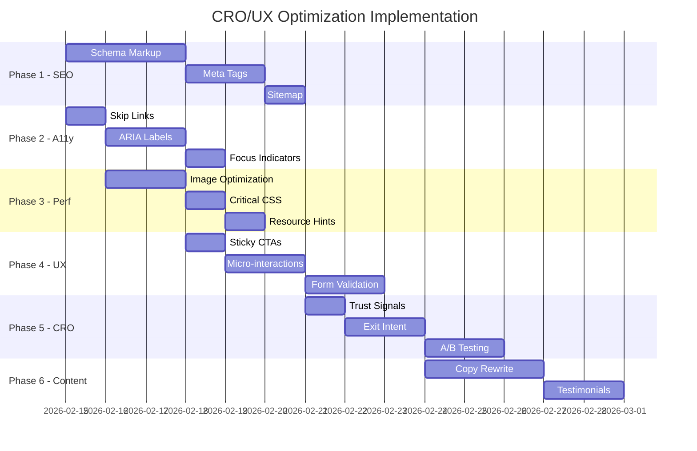

# Servio Restaurant Platform - CRO/UX Optimization Implementation Plan

## Executive Summary

This comprehensive plan outlines the implementation of Conversion Rate Optimization (CRO), User Experience (UX), and accessibility improvements for the Servio Restaurant Platform. The plan is organized into 6 phases with specific, actionable tasks.

---

## Current State Analysis

### Existing Optimizations (Already Implemented)
- ✅ Next.js Image optimization with AVIF/WebP formats
- ✅ Font optimization with Next.js Font (Inter)
- ✅ Dark mode support with theme context
- ✅ Service workers for offline capability
- ✅ Reduced motion media query support
- ✅ Basic SEO meta tags
- ✅ Cache-Control headers for static assets

### Critical Issues Identified
- 🔴 **Hero background image is 25MB** - Major performance bottleneck
- 🟡 Limited structured data (schema markup)
- 🟡 Accessibility improvements needed (ARIA labels, skip links)
- 🟡 No exit-intent or lead capture mechanisms
- 🟡 Limited social proof elements

---

## Phase 1: Technical SEO & Schema Markup

### 1.1 JSON-LD Structured Data Implementation

Create a new component for structured data:

```
frontend/components/SEO/StructuredData.tsx
```

**Schemas to implement:**

#### LocalBusiness Schema
```typescript
{
  "@context": "https://schema.org",
  "@type": "Restaurant",
  "name": "Servio",
  "description": "Restaurant Operating System with AI Assistant",
  "url": "https://servio.com",
  "logo": "https://servio.com/images/servio_icon_tight.png",
  "servesCuisine": ["Restaurant Management"],
  "priceRange": "$$",
  "aggregateRating": {
    "@type": "AggregateRating",
    "ratingValue": "4.9",
    "reviewCount": "150"
  }
}
```

#### SoftwareApplication Schema
```typescript
{
  "@context": "https://schema.org",
  "@type": "SoftwareApplication",
  "name": "Servio",
  "applicationCategory": "BusinessApplication",
  "operatingSystem": "Web",
  "offers": {
    "@type": "Offer",
    "price": "49.00",
    "priceCurrency": "USD"
  }
}
```

#### FAQ Schema (for FAQ section)
```typescript
{
  "@context": "https://schema.org",
  "@type": "FAQPage",
  "mainEntity": [
    {
      "@type": "Question",
      "name": "What is Servio?",
      "acceptedAnswer": {
        "@type": "Answer",
        "text": "Servio is a restaurant operating system..."
      }
    }
  ]
}
```

### 1.2 Enhanced Meta Tags

Update [`frontend/pages/_document.tsx`](frontend/pages/_document.tsx) and create:

```
frontend/components/SEO/EnhancedHead.tsx
```

**Include:**
- Open Graph tags (og:image, og:type, og:site_name)
- Twitter Card tags (twitter:card, twitter:site, twitter:image)
- Canonical URL
- Alternate languages (if applicable)
- Geo meta tags for local SEO

### 1.3 Dynamic Sitemap Generation

Create API route for dynamic sitemap:

```
frontend/pages/api/sitemap.ts
```

**Include all routes:**
- Homepage
- Login
- Dashboard pages (protected - list only)
- Book demo
- Privacy policy
- Terms and conditions

### 1.4 Enhanced robots.txt

Update [`frontend/public/robots.txt`](frontend/public/robots.txt:1):

```txt
User-agent: *
Allow: /
Disallow: /api/
Disallow: /dashboard/
Disallow: /admin/
Disallow: /staff/
Disallow: /tablet/

Sitemap: https://servio.com/sitemap.xml

# Crawl-delay for aggressive bots
Crawl-delay: 1
```

---

## Phase 2: Accessibility Compliance (WCAG 2.1 AA)

### 2.1 Skip Navigation Links

Create component:

```
frontend/components/Accessibility/SkipLinks.tsx
```

```tsx
<nav className="sr-only focus:not-sr-only">
  <a href="#main-content" className="skip-link">
    Skip to main content
  </a>
  <a href="#main-navigation" className="skip-link">
    Skip to navigation
  </a>
</nav>
```

### 2.2 ARIA Labels & Roles Audit

**Files to update:**
- [`frontend/pages/index.tsx`](frontend/pages/index.tsx:1) - Add ARIA landmarks
- [`frontend/components/Layout/DashboardLayout.tsx`](frontend/components/Layout/DashboardLayout.tsx) - Navigation roles
- All modal components - Add aria-modal, aria-labelledby

**Implementation pattern:**
```tsx
<button
  aria-label="Close menu"
  aria-expanded={isOpen}
  aria-controls="mobile-menu"
>
  <X className="h-6 w-6" aria-hidden="true" />
</button>
```

### 2.3 Focus Indicators

Add to [`frontend/styles/globals.css`](frontend/styles/globals.css:1):

```css
/* Enhanced focus indicators */
:focus-visible {
  outline: 3px solid var(--primary-500);
  outline-offset: 2px;
}

/* Remove default outline when using mouse */
:focus:not(:focus-visible) {
  outline: none;
}

/* Skip link styling */
.skip-link {
  position: absolute;
  top: -40px;
  left: 0;
  background: var(--primary-500);
  color: white;
  padding: 8px 16px;
  z-index: 100;
  transition: top 0.2s;
}

.skip-link:focus {
  top: 0;
}
```

### 2.4 Keyboard Navigation

**Implement in:**
- Modal components (Escape to close)
- Dropdown menus (Arrow keys)
- Tab lists (Arrow keys)
- Search components (Enter to submit)

### 2.5 Screen Reader Announcements

Create live region component:

```
frontend/components/Accessibility/LiveAnnouncer.tsx
```

```tsx
<div
  role="status"
  aria-live="polite"
  aria-atomic="true"
  className="sr-only"
>
  {announcement}
</div>
```

---

## Phase 3: Performance & Core Web Vitals

### 3.1 Critical: Hero Image Optimization

**Current issue:** [`frontend/public/images/hero_background.png`](frontend/public/images/hero_background.png) is 25MB

**Solution:**
1. Convert to WebP/AVIF format
2. Create multiple sizes for responsive loading
3. Implement blur placeholder
4. Use CSS gradient as fallback

**Commands:**
```bash
# Convert and optimize
npx sharp -i hero_background.png -o hero_background.webp
npx sharp -i hero_background.png -o hero_background.avif

# Create responsive versions
# 1920px, 1280px, 768px, 414px widths
```

### 3.2 Critical CSS Extraction

Add to [`frontend/next.config.js`](frontend/next.config.js:1):

```javascript
experimental: {
  optimizeCss: true,
},
```

### 3.3 Resource Hints

Update [`frontend/pages/_document.tsx`](frontend/pages/_document.tsx:1):

```tsx
<Head>
  {/* Preconnect to critical origins */}
  <link rel="preconnect" href="https://fonts.googleapis.com" />
  <link rel="preconnect" href="https://fonts.gstatic.com" crossOrigin="anonymous" />
  
  {/* Preload critical assets */}
  <link rel="preload" href="/fonts/inter-var.woff2" as="font" type="font/woff2" crossOrigin="anonymous" />
  
  {/* DNS prefetch for API */}
  <link rel="dns-prefetch" href="https://servio-backend-zexb.onrender.com" />
</Head>
```

### 3.4 Image Lazy Loading Component

Create:

```
frontend/components/ui/OptimizedImage.tsx
```

```tsx
import Image from 'next/image'

interface Props {
  src: string
  alt: string
  width: number
  height: number
  priority?: boolean
}

export function OptimizedImage({ src, alt, width, height, priority = false }: Props) {
  return (
    <Image
      src={src}
      alt={alt}
      width={width}
      height={height}
      loading={priority ? 'eager' : 'lazy'}
      placeholder="blur"
      blurDataURL="data:image/jpeg;base64,/9j/4AAQSkZJRgABAQAAAQ..."
    />
  )
}
```

---

## Phase 4: UX/UI Enhancements

### 4.1 Sticky CTAs with Scroll Triggers

Create:

```
frontend/components/ui/StickyCTA.tsx
```

```tsx
import { motion, useScroll, useTransform } from 'framer-motion'

export function StickyCTA() {
  const { scrollY } = useScroll()
  const opacity = useTransform(scrollY, [0, 300], [0, 1])
  const y = useTransform(scrollY, [0, 300], [100, 0])
  
  return (
    <motion.div
      style={{ opacity, y }}
      className="fixed bottom-4 left-4 right-4 md:left-auto md:right-4 md:w-auto z-40"
    >
      <Link
        href="/dashboard/assistant"
        className="block bg-gradient-to-r from-primary-500 to-primary-600 text-white px-6 py-3 rounded-xl font-semibold shadow-lg"
      >
        Start Free Trial
      </Link>
    </motion.div>
  )
}
```

### 4.2 Micro-interactions

**Add to components:**

```tsx
// Button hover animation
<motion.button
  whileHover={{ scale: 1.02 }}
  whileTap={{ scale: 0.98 }}
  transition={{ type: "spring", stiffness: 400, damping: 17 }}
>
  Click me
</motion.button>

// Success animation
<motion.div
  initial={{ scale: 0 }}
  animate={{ scale: 1 }}
  transition={{ type: "spring", stiffness: 260, damping: 20 }}
>
  <CheckCircle className="text-green-500" />
</motion.div>
```

### 4.3 Form Validation Enhancement

Create:

```
frontend/components/ui/FormInput.tsx
```

```tsx
import { motion, AnimatePresence } from 'framer-motion'

interface Props {
  label: string
  error?: string
  touched?: boolean
}

export function FormInput({ label, error, touched, ...props }: Props) {
  return (
    <div className="space-y-1">
      <label className="block text-sm font-medium">{label}</label>
      <input
        className={`w-full px-4 py-2 rounded-lg border ${
          error && touched ? 'border-red-500' : 'border-gray-300'
        }`}
        aria-invalid={error && touched}
        aria-describedby={error ? `${props.id}-error` : undefined}
        {...props}
      />
      <AnimatePresence>
        {error && touched && (
          <motion.p
            initial={{ opacity: 0, y: -10 }}
            animate={{ opacity: 1, y: 0 }}
            exit={{ opacity: 0, y: -10 }}
            className="text-red-500 text-sm"
            role="alert"
          >
            {error}
          </motion.p>
        )}
      </AnimatePresence>
    </div>
  )
}
```

### 4.4 Loading Skeletons

Enhance existing [`frontend/components/ui/Skeleton.tsx`](frontend/components/ui/Skeleton.tsx):

```tsx
// Add specific skeleton variants
export function MenuItemSkeleton() {
  return (
    <div className="animate-pulse">
      <div className="h-48 bg-gray-200 rounded-lg" />
      <div className="mt-4 h-4 bg-gray-200 rounded w-3/4" />
      <div className="mt-2 h-4 bg-gray-200 rounded w-1/2" />
    </div>
  )
}

export function DashboardCardSkeleton() {
  return (
    <div className="animate-pulse bg-white rounded-xl p-6 shadow">
      <div className="h-4 bg-gray-200 rounded w-1/3" />
      <div className="mt-4 h-8 bg-gray-200 rounded w-1/2" />
      <div className="mt-4 h-32 bg-gray-200 rounded" />
    </div>
  )
}
```

---

## Phase 5: Conversion Rate Optimization

### 5.1 Trust Signals & Social Proof

Create:

```
frontend/components/CRO/TrustSignals.tsx
```

```tsx
export function TrustSignals() {
  return (
    <div className="flex flex-wrap items-center justify-center gap-8 py-8">
      {/* Customer count */}
      <div className="flex items-center gap-2">
        <Users className="h-5 w-5 text-primary-500" />
        <span className="font-semibold">500+ Restaurants</span>
      </div>
      
      {/* Rating */}
      <div className="flex items-center gap-2">
        <div className="flex">
          {[...Array(5)].map((_, i) => (
            <Star key={i} className="h-5 w-5 text-yellow-400 fill-current" />
          ))}
        </div>
        <span className="font-semibold">4.9/5 Rating</span>
      </div>
      
      {/* Uptime */}
      <div className="flex items-center gap-2">
        <Shield className="h-5 w-5 text-green-500" />
        <span className="font-semibold">99.9% Uptime</span>
      </div>
    </div>
  )
}
```

### 5.2 Exit-Intent Popup

Create:

```
frontend/components/CRO/ExitIntentPopup.tsx
```

```tsx
import { useState, useEffect } from 'react'
import { motion, AnimatePresence } from 'framer-motion'

export function ExitIntentPopup() {
  const [showPopup, setShowPopup] = useState(false)
  const [hasShown, setHasShown] = useState(false)
  
  useEffect(() => {
    const handleMouseLeave = (e: MouseEvent) => {
      if (e.clientY <= 0 && !hasShown) {
        setShowPopup(true)
        setHasShown(true)
      }
    }
    
    document.addEventListener('mouseleave', handleMouseLeave)
    return () => document.removeEventListener('mouseleave', handleMouseLeave)
  }, [hasShown])
  
  return (
    <AnimatePresence>
      {showPopup && (
        <motion.div
          initial={{ opacity: 0 }}
          animate={{ opacity: 1 }}
          exit={{ opacity: 0 }}
          className="fixed inset-0 bg-black/50 z-50 flex items-center justify-center p-4"
        >
          <motion.div
            initial={{ scale: 0.9, opacity: 0 }}
            animate={{ scale: 1, opacity: 1 }}
            exit={{ scale: 0.9, opacity: 0 }}
            className="bg-white rounded-2xl p-8 max-w-md w-full"
          >
            <h3 className="text-2xl font-bold mb-4">
              Wait! Get 20% Off Your First Month
            </h3>
            <p className="text-gray-600 mb-6">
              Join 500+ restaurants already using Servio to streamline operations.
            </p>
            <form className="space-y-4">
              <input
                type="email"
                placeholder="Enter your email"
                className="w-full px-4 py-3 rounded-lg border"
              />
              <button className="w-full bg-primary-500 text-white py-3 rounded-lg font-semibold">
                Claim My Discount
              </button>
            </form>
            <button
              onClick={() => setShowPopup(false)}
              className="mt-4 text-gray-500 text-sm w-full text-center"
            >
              No thanks, I'll pay full price
            </button>
          </motion.div>
        </motion.div>
      )}
    </AnimatePresence>
  )
}
```

### 5.3 Urgency Elements

Create:

```
frontend/components/CRO/UrgencyBanner.tsx
```

```tsx
export function UrgencyBanner() {
  const [spots, setSpots] = useState(12)
  
  return (
    <div className="bg-gradient-to-r from-orange-500 to-red-500 text-white py-2 px-4 text-center">
      <span className="font-medium">
        🔥 Limited Time: {spots} spots remaining for priority onboarding this month
      </span>
    </div>
  )
}
```

### 5.4 A/B Testing Infrastructure

Create:

```
frontend/lib/abTesting.ts
```

```typescript
type Experiment = 'homepage_cta_color' | 'pricing_display' | 'hero_copy'

export function useExperiment(experiment: Experiment): string {
  const variant = useMemo(() => {
    // Check localStorage for existing assignment
    const stored = localStorage.getItem(`exp_${experiment}`)
    if (stored) return stored
    
    // Assign variant
    const variants: Record<Experiment, string[]> = {
      homepage_cta_color: ['primary', 'orange'],
      pricing_display: ['monthly', 'annual'],
      hero_copy: ['benefit', 'feature']
    }
    
    const assigned = variants[experiment][Math.floor(Math.random() * 2)]
    localStorage.setItem(`exp_${experiment}`, assigned)
    
    // Track assignment
    trackEvent('experiment_assigned', { experiment, variant: assigned })
    
    return assigned
  }, [experiment])
  
  return variant
}
```

### 5.5 Live Chat Widget Integration

Create integration component:

```
frontend/components/CRO/LiveChat.tsx
```

```tsx
import Script from 'next/script'

export function LiveChat() {
  return (
    <>
      <Script
        src="https://embed.tawk.to/YOUR_PROPERTY_ID/default"
        strategy="lazyOnload"
      />
    </>
  )
}
```

---

## Phase 6: Content Strategy Implementation

### 6.1 AIDA Framework Copy Rewrite

**Homepage sections to update in [`frontend/pages/index.tsx`](frontend/pages/index.tsx:1):**

#### Attention (Hero)
```tsx
// Current: "Restaurant Operating System"
// Improved: "Cut Staff Training Time in Half While Boosting Orders by 30%"
```

#### Interest (Problem Statement)
```tsx
// Add section highlighting pain points
<section className="py-16 bg-gray-50">
  <h2>Running a Restaurant Shouldn't Require 80-Hour Weeks</h2>
  <p>Between managing orders, training staff, and keeping inventory in check, 
     you're working harder than ever. Sound familiar?</p>
</section>
```

#### Desire (Benefits)
```tsx
// Transform feature list into benefit statements
const benefits = [
  {
    icon: Clock,
    title: "Save 15+ Hours Every Week",
    description: "Automate repetitive tasks so you can focus on what matters—your customers"
  },
  {
    icon: TrendingUp,
    title: "Increase Orders by 30%",
    description: "Our AI assistant handles orders faster than any human, reducing wait times"
  }
]
```

#### Action (CTAs)
```tsx
// Multiple CTAs throughout page
<Button variant="primary" size="lg">
  Start Your Free 14-Day Trial
  <ArrowRight className="ml-2" />
</Button>

<Button variant="secondary" size="lg">
  Book a 15-Min Demo
  <Calendar className="ml-2" />
</Button>
```

### 6.2 Testimonial Carousel

Create:

```
frontend/components/CRO/TestimonialCarousel.tsx
```

```tsx
const testimonials = [
  {
    quote: "Servio cut our order processing time by 60%. Game changer.",
    author: "Maria Chen",
    role: "Owner, Golden Dragon Restaurant",
    image: "/testimonials/maria.jpg",
    rating: 5
  },
  // ... more testimonials
]

export function TestimonialCarousel() {
  const [current, setCurrent] = useState(0)
  
  return (
    <div className="relative overflow-hidden">
      <motion.div
        animate={{ x: `-${current * 100}%` }}
        transition={{ type: "spring", stiffness: 300, damping: 30 }}
        className="flex"
      >
        {testimonials.map((t, i) => (
          <div key={i} className="w-full flex-shrink-0 px-4">
            <blockquote className="bg-white rounded-2xl p-8 shadow-lg">
              <p className="text-xl mb-4">"{t.quote}"</p>
              <div className="flex items-center gap-4">
                
                <div>
                  <p className="font-semibold">{t.author}</p>
                  <p className="text-gray-500 text-sm">{t.role}</p>
                </div>
              </div>
            </blockquote>
          </div>
        ))}
      </motion.div>
    </div>
  )
}
```

### 6.3 FAQ Section with Schema

Enhance existing FAQ with structured data:

```
frontend/components/SEO/FAQSchema.tsx
```

---

## Implementation Timeline



---

## Files to Create/Modify Summary

### New Files to Create
| File Path | Purpose |
|-----------|---------|
| `frontend/components/SEO/StructuredData.tsx` | JSON-LD schema markup |
| `frontend/components/SEO/EnhancedHead.tsx` | Enhanced meta tags |
| `frontend/components/Accessibility/SkipLinks.tsx` | Skip navigation |
| `frontend/components/Accessibility/LiveAnnouncer.tsx` | Screen reader announcements |
| `frontend/components/ui/StickyCTA.tsx` | Sticky call-to-action |
| `frontend/components/ui/FormInput.tsx` | Validated form input |
| `frontend/components/ui/OptimizedImage.tsx` | Lazy-loaded images |
| `frontend/components/CRO/TrustSignals.tsx` | Social proof elements |
| `frontend/components/CRO/ExitIntentPopup.tsx` | Lead capture popup |
| `frontend/components/CRO/UrgencyBanner.tsx` | Urgency indicators |
| `frontend/components/CRO/TestimonialCarousel.tsx` | Customer testimonials |
| `frontend/components/CRO/LiveChat.tsx` | Chat widget integration |
| `frontend/lib/abTesting.ts` | A/B testing utilities |
| `frontend/pages/api/sitemap.ts` | Dynamic sitemap |

### Files to Modify
| File Path | Changes |
|-----------|---------|
| `frontend/pages/_document.tsx` | Add resource hints, skip links |
| `frontend/pages/index.tsx` | AIDA copy, CTAs, testimonials |
| `frontend/next.config.js` | CSS optimization, headers |
| `frontend/styles/globals.css` | Focus indicators, accessibility |
| `frontend/public/robots.txt` | Enhanced directives |
| `frontend/components/ui/Skeleton.tsx` | Add skeleton variants |

---

## Success Metrics

| Metric | Current | Target | Measurement |
|--------|---------|--------|-------------|
| Lighthouse Performance | TBD | >90 | Chrome DevTools |
| Lighthouse Accessibility | TBD | 100 | Chrome DevTools |
| Lighthouse SEO | TBD | 100 | Chrome DevTools |
| Core Web Vitals - LCP | TBD | <2.5s | Web Vitals |
| Core Web Vitals - FID | TBD | <100ms | Web Vitals |
| Core Web Vitals - CLS | TBD | <0.1 | Web Vitals |
| Conversion Rate | TBD | +25% | Analytics |
| Bounce Rate | TBD | -15% | Analytics |

---

## Next Steps

1. **Immediate Priority**: Fix the 25MB hero image (Phase 3.1)
2. **Quick Wins**: Implement schema markup and trust signals (Phases 1 & 5)
3. **Compliance**: Complete accessibility audit and fixes (Phase 2)
4. **Testing**: Set up A/B testing infrastructure before major copy changes
5. **Monitor**: Establish baseline metrics before implementing changes

Switch to **Code mode** to begin implementation of this plan.
