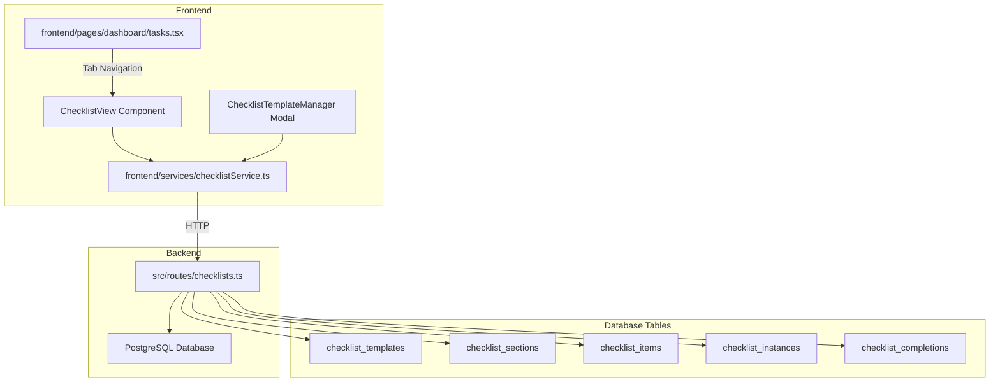

# Daily Checklists Feature Implementation Plan

## Overview
This plan outlines the implementation of a Daily Checklists feature for the Servio Restaurant Platform's Task Manager at `/dashboard/tasks`. The feature will coexist with the existing task system.

## Project Structure Analysis
- **Backend**: Express.js with PostgreSQL database
- **Frontend**: Next.js with TypeScript, Tailwind CSS, Framer Motion
- **API Pattern**: RESTful endpoints registered in `server.ts`
- **Database**: PostgreSQL with migrations in `src/database/migrations`
- **Frontend API Client**: Axios-based `api` object in `frontend/lib/api.ts`

## Architecture



## Implementation Steps

### Step 1: Database Migration
**File**: `src/database/migrations/XXX_add_checklist_tables.sql`

Create SQL migration with:
- `checklist_templates` - reusable templates
- `checklist_sections` - sections within templates
- `checklist_items` - individual items
- `checklist_instances` - daily instances
- `checklist_completions` - item completion tracking

### Step 2: Backend API Routes
**File**: `src/routes/checklists.ts`

Endpoints:
- `GET /api/checklists/templates` - list templates
- `POST /api/checklists/templates` - create template
- `PUT /api/checklists/templates/:id` - update template
- `DELETE /api/checklists/templates/:id` - delete template
- `GET /api/checklists/today` - get/create today's instances
- `POST /api/checklists/:instanceId/toggle/:itemId` - toggle item
- `GET /api/checklists/history` - past checklists

### Step 3: Register Routes
**File**: `src/server.ts`

Add route registration:
```typescript
const { default: checklistsRoutes } = await import('./routes/checklists');
app.use('/api/checklists', checklistsRoutes);
```

### Step 4: Frontend API Service
**File**: `frontend/services/checklistService.ts`

TypeScript interfaces and API functions for:
- Template CRUD operations
- Fetching daily instances
- Toggling item completion
- Fetching history

### Step 5: Frontend UI Components

#### 5a. Tab Navigation (tasks.tsx)
Add tab bar with "Tasks" and "Daily Checklists" tabs using existing UI patterns:
```tsx
<div className="flex items-center gap-2 bg-surface-100 dark:bg-surface-800 rounded-lg p-1">
  <button className={activeTab === 'tasks' ? 'bg-white dark:bg-surface-700' : ''}>
    Tasks
  </button>
  <button className={activeTab === 'checklists' ? 'bg-white dark:bg-surface-700' : ''}>
    Daily Checklists
  </button>
</div>
```

#### 5b. ChecklistView Component
**File**: `frontend/components/checklists/ChecklistView.tsx`

Features:
- Date selector (defaults to today)
- Progress summary bar
- Collapsible accordion sections
- Checkbox items with strikethrough styling
- Critical item highlighting (warning style)
- Completion timestamps

#### 5c. Template Manager Modal
**File**: `frontend/components/checklists/ChecklistTemplateManager.tsx`

Features:
- Create/edit/delete templates
- Add/remove/reorder sections
- Add/remove/reorder items
- Set recurrence days
- Assign staff per section

### Step 6: Seed Data
**File**: `src/database/migrations/XXX_seed_sashey_checklist.sql`

Pre-populate with Sashey's Kitchen checklist template containing:
- 5 sections with emojis
- 35+ items across sections
- Daily recurrence
- Critical section (Steam Table Setup)

## Staff Members Available
- Cynthia Dominguez
- Ernesto
- Faruk Bakere
- Sashey (Owner)
- Wiltes

## UI/UX Requirements
- Match existing Servio UI (sidebar, cards, color scheme)
- Light/dark theme support
- Mobile responsive
- Real-time updates via socket (optional enhancement)

## Checklist Component Structure

```tsx
interface ChecklistTemplate {
  id: number;
  restaurant_id: number;
  name: string;
  description?: string;
  recurrence: 'daily' | 'weekly' | 'custom';
  recurrence_days: number[]; // 0=Sun, 6=Sat
  is_active: boolean;
  sections: ChecklistSection[];
}

interface ChecklistSection {
  id: number;
  template_id: number;
  name: string;
  emoji?: string;
  sort_order: number;
  assigned_to?: number;
  assigned_to_name?: string;
  items: ChecklistItem[];
}

interface ChecklistItem {
  id: number;
  section_id: number;
  text: string;
  sort_order: number;
  is_critical: boolean;
}

interface ChecklistInstance {
  id: number;
  template_id: number;
  restaurant_id: number;
  date: string;
  status: 'active' | 'completed';
  completed_at?: string;
  template: ChecklistTemplate;
  sections: ChecklistSection[];
  completions: ChecklistCompletion[];
}

interface ChecklistCompletion {
  id: number;
  instance_id: number;
  item_id: number;
  completed_by?: number;
  completed_by_name?: string;
  completed_at: string;
}
```

## File Manifest

### Backend (New Files)
1. `src/database/migrations/XXX_add_checklist_tables.sql` - Database schema
2. `src/database/migrations/XXX_seed_sashey_checklist.sql` - Seed data
3. `src/routes/checklists.ts` - API routes

### Backend (Modified Files)
1. `src/server.ts` - Register checklists routes

### Frontend (New Files)
1. `frontend/services/checklistService.ts` - API service
2. `frontend/components/checklists/ChecklistView.tsx` - Main checklist view
3. `frontend/components/checklists/ChecklistSection.tsx` - Section accordion
4. `frontend/components/checklists/ChecklistItem.tsx` - Individual item
5. `frontend/components/checklists/ChecklistTemplateManager.tsx` - Template editor modal
6. `frontend/components/checklists/index.ts` - Export barrel

### Frontend (Modified Files)
1. `frontend/pages/dashboard/tasks.tsx` - Add tab navigation

## Implementation Priority
1. Database migration (foundation)
2. Backend API routes
3. Frontend API service
4. Basic ChecklistView component
5. Template Manager modal
6. Integration with tasks.tsx
7. Seed data
8. Testing and refinement
