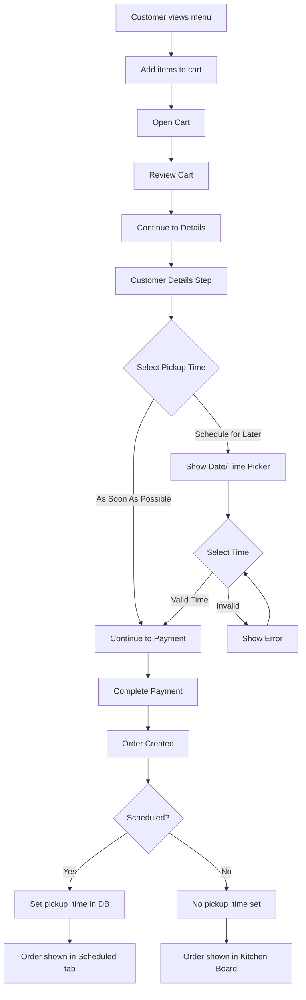

# Scheduled Orders Implementation Plan

## Overview
Add the ability for customers to schedule orders for a later date/time on the public ordering page.

## Current State Analysis

### Backend (src/routes/orders.ts)
- Public order creation endpoint: `POST /api/orders/public/:slug`
- Current fields: items, customerName, customerPhone, customerEmail, orderType, specialInstructions, paymentMethod, marketingConsent, taxRate, restaurantState, subtotal, tax, total
- **Missing**: `scheduled_pickup_time` field
- Database has `pickup_time` column but not populated from public ordering

### Frontend
- Public ordering page: `frontend/pages/r/[...slug].tsx`
- Cart hook: `frontend/components/order/useCart.ts`
- Cart Modal: `frontend/components/order/CartModal.tsx`
- CustomerDetailsStep component inside CartModal
- KitchenBoard already has a "Scheduled" tab that filters by future `pickup_time`

---

## Implementation Details

### 1. Backend Changes

#### File: `src/routes/orders.ts`

**Add to public order creation endpoint (around line 687-703):**
```typescript
// Add to destructured body
scheduledPickupTime,
```

**Add validation (after line 765):**
```typescript
// Validate scheduled pickup time if provided
let normalizedScheduledPickupTime = null;
if (scheduledPickupTime) {
  const scheduledDate = new Date(scheduledPickupTime);
  const now = new Date();
  const minTime = new Date(now.getTime() + 15 * 60 * 1000); // 15 min from now
  const maxTime = new Date(now.getTime() + 7 * 24 * 60 * 60 * 1000); // 7 days ahead

  if (isNaN(scheduledDate.getTime())) {
    return res.status(400).json({ success: false, error: { message: 'Invalid scheduled pickup time' } });
  }
  if (scheduledDate < minTime) {
    return res.status(400).json({ success: false, error: { message: 'Scheduled pickup must be at least 15 minutes from now' } });
  }
  if (scheduledDate > maxTime) {
    return res.status(400).json({ success: false, error: { message: 'Cannot schedule more than 7 days in advance' } });
  }
  normalizedScheduledPickupTime = scheduledDate.toISOString();
}
```

**Update INSERT statement (around line 820-841):**
Add `pickup_time` column:
```typescript
INSERT INTO orders (
  id, restaurant_id, channel, status, total_amount, payment_status,
  items, customer_name, customer_phone, customer_email, order_type, 
  special_instructions, marketing_consent, subtotal, tax, fees, 
  pickup_time, created_at, updated_at
) VALUES (?, ?, 'website', 'received', ?, ?, ?, ?, ?, ?, ?, ?, ?, ?, ?, ?, ?, ?, CURRENT_TIMESTAMP, CURRENT_TIMESTAMP)
```

And add `normalizedScheduledPickupTime` to the VALUES array.

---

### 2. Frontend Changes

#### File: `frontend/components/order/types.ts`

Add scheduling types:
```typescript
export interface CustomerInfo {
  name: string;
  phone: string;
  email: string;
  orderType: 'pickup' | 'dine-in';
  specialInstructions: string;
  // Add these:
  scheduleForLater: boolean;
  scheduledPickupTime: string | null;
}
```

#### File: `frontend/components/order/useCart.ts`

**Add state:**
```typescript
// Already has: pickupTime, setPickupTime
// Add scheduling state (or reuse existing):
const [scheduleForLater, setScheduleForLater] = useState(false);
const [scheduledPickupTime, setScheduledPickupTime] = useState<string | null>(null);
```

**Update handlePlaceOrder:**
```typescript
// Add to API payload:
scheduledPickupTime: scheduleForLater ? scheduledPickupTime : null,
```

**Update return:**
```typescript
scheduleForLater,
setScheduleForLater,
scheduledPickupTime,
setScheduledPickupTime,
```

#### File: `frontend/components/order/CartModal.tsx`

**Update CustomerDetailsStep component:**

1. Add import for Calendar icon and Clock icon
2. Add props:
```typescript
scheduleForLater: boolean;
setScheduleForLater: (v: boolean) => void;
scheduledPickupTime: string | null;
setScheduledPickupTime: (t: string | null) => void;
restaurantHours?: { open: string; close: string }; // e.g., "09:00", "22:00"
```

3. Add "Schedule for Later" toggle after Order Type selection (around line 293):
```tsx
<div className="mb-4">
  <label className="block text-sm font-semibold text-gray-700 mb-2">
    Pickup Time
  </label>
  <div className="flex gap-3">
    <button
      onClick={() => setScheduleForLater(false)}
      className={`flex-1 py-3 px-4 rounded-xl border-2 font-semibold transition-all ${
        !scheduleForLater
          ? 'border-blue-600 bg-blue-50 text-blue-700'
          : 'border-gray-200 text-gray-600 hover:border-gray-300'
      }`}
    >
      As Soon As Possible
    </button>
    <button
      onClick={() => setScheduleForLater(true)}
      className={`flex-1 py-3 px-4 rounded-xl border-2 font-semibold transition-all ${
        scheduleForLater
          ? 'border-blue-600 bg-blue-50 text-blue-700'
          : 'border-gray-200 text-gray-600 hover:border-gray-300'
      }`}
    >
      Schedule for Later
    </button>
  </div>
</div>
```

4. Add date/time picker when scheduleForLater is true:
```tsx
{scheduleForLater && (
  <div className="mb-4 animate-fadeIn">
    <label className="block text-sm font-semibold text-gray-700 mb-2">
      <Clock className="w-4 h-4 inline mr-2" />
      Select Pickup Time
    </label>
    <input
      type="datetime-local"
      value={scheduledPickupTime || ''}
      onChange={(e) => setScheduledPickupTime(e.target.value || null)}
      min={getMinDateTime()}
      max={getMaxDateTime()}
      className="w-full px-4 py-3 border-2 border-gray-200 rounded-xl focus:border-blue-500 focus:outline-none text-lg"
    />
    <p className="text-xs text-gray-500 mt-1">
      Schedule at least 15 minutes in advance (max 7 days)
    </p>
  </div>
)}
```

Add helper functions:
```typescript
const getMinDateTime = () => {
  const now = new Date();
  now.setMinutes(now.getMinutes() + 15);
  return now.toISOString().slice(0, 16);
};

const getMaxDateTime = () => {
  const max = new Date();
  max.setDate(max.getDate() + 7);
  return max.toISOString().slice(0, 16);
};
```

5. Add validation in onProceed:
```typescript
if (scheduleForLater && !scheduledPickupTime) {
  toast.error('Please select a pickup time');
  return;
}
```

#### File: `frontend/components/order/OrderConfirmation.tsx`

Update to display scheduled pickup time if present:
```tsx
{pickupTime && (
  <div className="bg-blue-50 border border-blue-200 rounded-xl p-4 mb-4">
    <div className="flex items-center gap-2 text-blue-700">
      <CalendarClock className="w-5 h-5" />
      <span className="font-semibold">Scheduled Pickup</span>
    </div>
    <p className="text-blue-600 mt-1">
      {formatPickupTime(pickupTime)}
    </p>
  </div>
)}
```

---

### 3. Update Public Ordering Page

#### File: `frontend/pages/r/[...slug].tsx`

Pass scheduling props to CartModal:
```tsx
<CartModal
  // ... existing props
  scheduleForLater={cart.scheduleForLater}
  setScheduleForLater={cart.setScheduleForLater}
  scheduledPickupTime={cart.scheduledPickupTime}
  setScheduledPickupTime={cart.setScheduledPickupTime}
/>
```

---

## Mermaid Flow Diagram



---

## Database Schema Consideration

The `orders` table already has a `pickup_time` column. No schema changes needed.

---

## Summary of Files to Modify

| File | Changes |
|------|---------|
| `src/routes/orders.ts` | Add scheduled_pickup_time to body parsing, validation, and INSERT |
| `frontend/components/order/types.ts` | Add scheduling fields to CustomerInfo |
| `frontend/components/order/useCart.ts` | Add scheduling state and pass to API |
| `frontend/components/order/CartModal.tsx` | Add scheduling toggle and date/time picker UI |
| `frontend/components/order/OrderConfirmation.tsx` | Display scheduled pickup time |
| `frontend/pages/r/[...slug].tsx` | Pass scheduling props to CartModal |

---

## Testing Checklist

- [ ] Toggle between "As Soon As Possible" and "Schedule for Later"
- [ ] Date/time picker respects minimum 15-minute lead time
- [ ] Date/time picker respects maximum 7-day advance limit
- [ ] Scheduled order appears in KitchenBoard "Scheduled" tab
- [ ] OrderConfirmation shows scheduled pickup time
- [ ] API rejects invalid scheduled times with appropriate error
- [ ] Non-scheduled orders still work correctly
