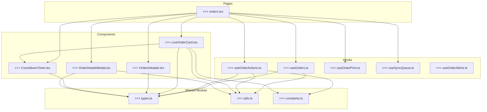

# Tablet Orders Page - Improvement Plan

## Executive Summary

The tablet orders page (`/tablet/orders`) is a critical kitchen display system (KDS) interface. Analysis reveals significant code quality issues that impact maintainability, performance, and developer experience. This plan outlines comprehensive improvements.

---

## Current State Analysis

### Files Examined
| File | Lines | Issues |
|------|-------|--------|
| `frontend/pages/tablet/orders.tsx` | 2,282 | Critical - monolithic, unused code, duplicate logic |
| `frontend/components/tablet/orders/LiveOrderCard.tsx` | 486 | Moderate - duplicated utilities |
| `frontend/components/tablet/orders/OrdersHeader.tsx` | 107 | Minimal - well-structured |
| `frontend/components/tablet/orders/CountdownTimer.tsx` | 222 | Minimal - good hook extraction |

### Critical Issues Identified

#### 1. **Dead Code - Unused KDSOrderCard Component**
- Location: [`orders.tsx:31-287`](frontend/pages/tablet/orders.tsx:31)
- **Status**: Defined but NEVER rendered
- The component is duplicated and never used in the JSX
- Size: ~256 lines of dead code

#### 2. **Massive Monolithic Component**
- Single file with 2,282 lines mixing:
  - UI components
  - Business logic
  - State management
  - API calls
  - WebSocket handling
  - Print functionality
  - Offline queue management

#### 3. **Duplicated Utility Functions**
Identical functions exist in multiple files:

| Function | `orders.tsx` | `LiveOrderCard.tsx` |
|----------|--------------|---------------------|
| `normalizeStatus()` | Lines 31-37 | Lines 72-81 |
| `formatMoney()` | Lines 382-389 | Lines 37-44 |
| `formatTimeAgo()` | Lines 391-409 | Lines 46-64 |
| `getChannelIcon()` | Lines 565-576 | Lines 83-94 |

#### 4. **Excessive State Hooks**
```typescript
// 20+ useState declarations in single component
const [orders, setOrders] = useState<Order[]>([]);
const [loading, setLoading] = useState(true);
const [busyId, setBusyId] = useState<string | null>(null);
const [now, setNow] = useState<number | null>(null);
const [autoPrintEnabled, setAutoPrintEnabled] = useState<boolean>(false);
// ... 15+ more
```

#### 5. **Inline Style Objects**
- Multiple `statusStyles` objects defined inline (lines 39-55, 859-864)
- Not using theme variables consistently

---

## Improvement Roadmap

### Phase 1: Foundation (Shared Module)

#### 1.1 Create Shared Types Module
```
frontend/components/tablet/orders/types.ts
```
**Contents:**
- [ ] Consolidate `Order`, `OrderItem`, `OrderStatus` types
- [ ] Define `UrgencyLevel` type
- [ ] Export unified types for all tablet order components

#### 1.2 Create Shared Utilities Module
```
frontend/components/tablet/orders/utils.ts
```
**Contents:**
- [ ] `normalizeStatus()` - unified implementation
- [ ] `formatMoney()` - unified implementation
- [ ] `formatTimeAgo()` - unified implementation
- [ ] `getChannelIcon()` - unified implementation
- [ ] `getOrderUrgencyLevel()` - unified implementation
- [ ] `normalizeOrderItems()` - move from main page

#### 1.3 Create Shared Constants Module
```
frontend/components/tablet/orders/constants.ts
```
**Contents:**
- [ ] `STATUS_STYLES` - color configurations for each status
- [ ] `URGENCY_THRESHOLDS` - time thresholds for urgency levels
- [ ] `STALE_ORDER_THRESHOLD_MINUTES` - from env

---

### Phase 2: Component Refactoring

#### 2.1 Update LiveOrderCard
**Path:** `frontend/components/tablet/orders/LiveOrderCard.tsx`

**Changes:**
- [ ] Import shared types from `types.ts`
- [ ] Import utilities from `utils.ts`
- [ ] Remove local duplicate functions
- [ ] Extract `StatusBadge` as standalone component
- [ ] Extract `TimePill` as standalone component
- [ ] Extract `ActionButton` variants as reusable components

#### 2.2 Update CountdownTimer
**Path:** `frontend/components/tablet/orders/CountdownTimer.tsx`

**Changes:**
- [ ] Already well-structured - minimal changes needed
- [ ] Consider extracting `useCountdownTimer` hook to utils

#### 2.3 Update OrdersHeader
**Path:** `frontend/components/tablet/orders/OrdersHeader.tsx`

**Changes:**
- [ ] Already well-structured - no changes needed
- [ ] Verify imports use shared types

---

### Phase 3: Main Page Refactoring

#### 3.1 Remove Dead Code
**Path:** `frontend/pages/tablet/orders.tsx`

**Changes:**
- [ ] **DELETE** `KDSOrderCard` component (lines 31-287)
- [ ] **DELETE** duplicate inline style objects
- [ ] **DELETE** duplicate helper functions

#### 3.2 Extract Business Logic Hooks

**New Files:**

##### `frontend/hooks/tablet/useOrders.ts`
```typescript
// Contents:
- [ ] Order fetching and caching
- [ ] Order state management
- [ ] Order filtering and sorting logic
- [ ] WebSocket integration for order updates
```

##### `frontend/hooks/tablet/useOrderActions.ts`
```typescript
// Contents:
- [ ] `acceptOrder()` function
- [ ] `declineOrder()` function
- [ ] `setStatus()` function
- [ ] `setPrepTime()` function
- [ ] Action queue management
```

##### `frontend/hooks/tablet/useOrderPrint.ts`
```typescript
// Contents:
- [ ] Print configuration state
- [ ] `printOrder()` function
- [ ] `printTestReceipt()` function
- [ ] Auto-print logic
```

##### `frontend/hooks/tablet/useSyncQueue.ts`
```typescript
// Contents:
- [ ] Offline action queue
- [ ] Queue persistence to localStorage
- [ ] Queue processing
- [ ] Retry logic
```

#### 3.3 Simplify Main Component

**Refactored `orders.tsx` structure:**
```typescript
// Imports (shared types, utilities, hooks)
import { useOrders } from '@/hooks/tablet/useOrders';
import { useOrderActions } from '@/hooks/tablet/useOrderActions';
import { useOrderPrint } from '@/hooks/tablet/useOrderPrint';
import { useSyncQueue } from '@/hooks/tablet/useSyncQueue';
import { LiveOrderCard } from '@/components/tablet/orders/LiveOrderCard';

// Main component - should be ~300 lines
export default function TabletOrdersPage() {
  // Use custom hooks instead of inline state
  const { orders, loading, refresh, filteredOrders } = useOrders();
  const { setStatus, acceptOrder, declineOrder, busyId } = useOrderActions();
  const { printOrder } = useOrderPrint();
  const { actionQueue, processActionQueue } = useSyncQueue();
  
  // Minimal render logic
  return (...);
}
```

---

### Phase 4: Additional Improvements

#### 4.1 Performance Optimizations
- [ ] Implement virtualization for large order lists (react-virtual)
- [ ] Memoize expensive filtering operations
- [ ] Use `useTransition` for non-urgent updates
- [ ] Implement requestAnimationFrame batching for timer updates

#### 4.2 Accessibility Improvements
- [ ] Add proper ARIA labels to all interactive elements
- [ ] Implement keyboard navigation between order cards
- [ ] Add screen reader announcements for new orders
- [ ] Ensure color contrast meets WCAG AA

#### 4.3 Error Handling
- [ ] Implement ErrorBoundary for order card rendering
- [ ] Add retry UI for failed actions
- [ ] Improve offline indicator visibility

#### 4.4 Testing
- [ ] Add unit tests for utility functions
- [ ] Add integration tests for order actions
- [ ] Add E2E tests for critical flows

---

## Architecture Diagram



---

## Implementation Order

### Week 1: Foundation
1. Create `types.ts` - unified type definitions
2. Create `utils.ts` - shared utility functions
3. Create `constants.ts` - shared constants
4. Update all components to import from shared modules
5. Remove duplicates from `LiveOrderCard.tsx`

### Week 2: Hooks Extraction
1. Create `useOrders.ts` hook
2. Create `useOrderActions.ts` hook
3. Create `useOrderPrint.ts` hook
4. Create `useSyncQueue.ts` hook
5. Begin refactoring `orders.tsx` to use hooks

### Week 3: Main Page Cleanup
1. Remove `KDSOrderCard` dead code
2. Complete `orders.tsx` refactoring
3. Verify all functionality works
4. Fix any TypeScript errors
5. Update imports/exports

### Week 4: Polish
1. Performance optimization pass
2. Accessibility audit
3. Error handling improvements
4. Documentation updates
5. Testing additions

---

## Success Metrics

| Metric | Current | Target |
|--------|---------|--------|
| Main page line count | 2,282 | <500 |
| Duplicate functions | 4 | 0 |
| Custom hooks | 0 | 4+ |
| Shared modules | 0 | 3 |
| Dead code percentage | ~11% | 0% |
| TypeScript errors | TBD | 0 |

---

## Risk Mitigation

| Risk | Mitigation |
|------|------------|
| Breaking existing functionality | Incremental changes with testing after each |
| State management bugs | Careful hook extraction with preserved behavior |
| Performance regression | Performance testing after each phase |
| Missing edge cases | Comprehensive test coverage |

---

## Questions for Stakeholder

1. **Priority Order**: Should we prioritize code cleanliness or adding new features?
2. **Testing**: What level of test coverage is required before refactoring?
3. **Timeline**: Is there a preferred order for implementing the phases?
4. **Breaking Changes**: Are API-level changes acceptable if they improve the codebase?
